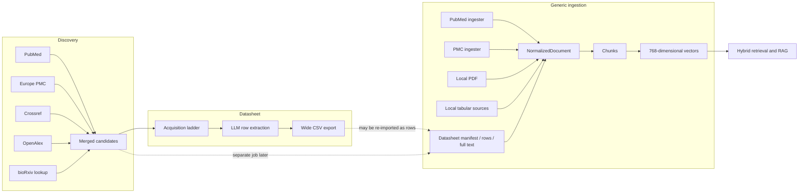

# Current-State Audit

## 1. Audit Method

This audit read the repository as an implemented system, not only as its intended architecture. It covered:

- root guidance, plans, operational notes, and mistakes log;
- FastAPI routes, services, ORM models, migrations, workers, and retrieval code;
- discovery connectors, canonicalisation, acquisition, parsing, extraction, export, and indexing;
- Next.js workflow screens and API clients;
- tests, configuration files, cache manifests, and on-disk corpus records;
- repository history and current worktree state.

The review also ran the principal verification commands. At review time:

- backend tests collected 695 tests: 694 passed and 1 failed;
- the one failure was caused by a test reading a real shared PubMed checkpoint from `./data/checkpoints`, which changed the expected search behaviour;
- frontend tests passed 148 tests in 19 files;
- frontend type checking passed;
- Ruff reported six unused imports;
- the corpus cache validator passed even though semantic duplication and stale manifest metadata were present.

This matters: the project is heavily tested, but many tests validate components in isolation. They do not yet validate the lifecycle as an auditable scientific-data system.

## 2. Current System in One Diagram



There is no single authoritative route from source observation to searchable evidence. Instead, data can enter through several routes, each preserving different provenance and using different notions of identity.

## 3. Overall Assessment

The project did not merely expand from PubMed. It accumulated a second product inside the first one.

The original architecture is visible in [the root README](../README.md), [architecture documentation](../docs/architecture.md), [component inventory](../docs/components.md), and the initial ORM: one paper becomes one `Document`, one document becomes chunks, and each chunk has one PubMedBERT-shaped vector. The datasheet work then added multi-source discovery, acquisition, extraction, and export beside that model. Local inventories and protocols were later flattened into the paper model as well.

The result is not a bad prototype. It is a prototype whose successful experiments have revealed the wrong permanent boundaries.

### Severity Summary

| Severity | Count | Meaning |
|---|---:|---|
| Critical | 3 | Security, authorisation, or scientific traceability failure requiring correction before generalisation. |
| High | 11 | Can produce incorrect identity, incomplete evidence, unreproducible outputs, or unsafe migration. |
| Medium | 12 | Causes operational drift, confusing state, weak scale characteristics, or misleading documentation. |
| Positive | 9 | Proven decisions worth preserving in the new design. |

## 4. Critical Findings

### C-1. A plaintext-looking credential file is tracked

`backend/adminPass` is a tracked ASCII file with a credential-like name. This is an incident-response issue, not a future backlog item.

Required response:

1. Assume exposure and rotate or revoke the credential.
2. Review authentication and deployment logs for suspicious use.
3. Remove it from the tracked tree.
4. Run a full repository secret scan.
5. Decide with the repository owner whether history must be rewritten.
6. Add CI secret scanning and a pre-commit scanner.

No migration artifact should contain the secret value.

### C-2. Retrieval does not enforce document-level access policy

The data model includes global metadata such as sensitivity and source type, but RAG filtering in `backend/app/rag/retrieval.py` only enforces `chat_visible` and retraction state. `chat_visible` is a global Boolean, not a per-workspace or per-user grant.

For a one-lab prototype this is survivable. For an "any lab" product it is an immediate cross-lab and intra-lab leakage risk. Policy filtering must happen before scoring, be repeated after retrieval as defence in depth, and apply equally to chunks, claims, assets, exports, and citations.

### C-3. Extracted evidence is accepted without mechanical verification

The LLM returns value, quote, section, and confidence fields. The extraction service normalises them but does not verify that:

- the quote occurs in the selected rendition;
- the section exists;
- the evidence belongs to the focal study rather than a cited study;
- offsets remain stable;
- a number and unit agree with the proposed value.

Consequently the system can present a precise-looking evidence citation that is not an evidence pointer. Scientific extraction outputs must be treated as proposals until schema validation, span validation, and review have succeeded.

## 5. High-Severity Findings by Lifecycle Stage

### 5.1 Discovery

#### H-1. The so-called raw discovery cache is post-merge data

`pipelines/discovery/ingester.py` writes merged candidate records to `raw/discovery/candidates.jsonl`. Raw source responses and per-source assertions are not retained. A parser or canonicalisation bug therefore cannot be repaired by replaying original upstream observations.

The registered checksum can also refer to a file that is subsequently appended to. That breaks the meaning of content registration.

#### H-2. Canonicalisation loses field-level provenance

Discovery merges scalars using whole-source priority. The system may retain source-specific extras, but it cannot answer "which source asserted this title on this date, using which connector version?" for every canonical field.

Strong-identifier-only grouping was a good correction after title-based merging incorrectly combined distinct DOIs. However, transitive identifier bridges can still combine conflicting identities without a quarantine state and a human merge decision.

#### H-3. Inclusion and adjudication are inconsistent

Unknown relevance is included automatically. Documentation describes LLM adjudication that the implementation does not perform. There are no first-class include, exclude, merge, split, or resolve-conflict actions in the API and UI.

Identifierless candidates are also represented inconsistently: backend persistence can include them, while one manifest path determines inclusion from a DOI set and therefore records them as excluded.

### 5.2 Acquisition

#### H-4. Acquisition is not truly fetch-once

The datasheet acquisition cache lives inside a unique run directory and is keyed by a DOI-derived filename. A later run does not share the asset as an immutable content-addressed object. Documentation claiming fetch-once across runs is therefore incorrect.

#### H-5. Acquisition attempts and rights decisions are not durable records

The route ladder distinguishes useful states such as not found, blocked, rate limited, assisted, and acquired. That is good. The service then persists mostly the final route/status/note and discards the full attempt history. Stored files lack a uniform asset manifest containing source URL, response metadata, checksum, MIME evidence, retriever version, licence assertion, rights decision, and policy basis.

#### H-6. Assisted acquisition is a one-way queue

The application can export links for manual acquisition, and a generic PDF upload path exists elsewhere. There is no candidate-level upload/register action that attaches a manually obtained file to the queued work, validates it, records its rights basis, and resumes the same run.

### 5.3 Parsing and Extraction

#### H-7. Abstract-only extraction is not reliably implemented

Extraction reads acquired full-text JSON files. Candidate abstracts are not preserved as durable extraction inputs in the datasheet database or run manifest. A candidate without acquired full text can therefore disappear from extraction, contrary to plans describing abstract-tier rows.

#### H-8. The extraction cache key is scientifically incomplete

The key uses selected-text hash, integer template version, and model. It omits template identity, exact schema and prompts, selector version, parser version, prompt builder version, model settings, rights scope, and relevant deterministic metadata. Two different templates at version `1` can collide. Prompt changes can silently reuse stale output.

#### H-9. The row model cannot represent the scientific object

The default template emits one wide row per paper. A paper can contain many strains, experiments, products, conditions, controls, and measurements. Delegating bibliographic fields to the model compounds the problem because deterministic source metadata is not consistently supplied.

The correct scientific core is a set of entities, experiments, conditions, claims, and evidence links. A datasheet row is an export projection of that graph.

#### H-10. Human review is data, but is not implemented as a workflow

Rows have a `review_status`, yet there are no complete cell-level edit, accept, reject, correction-reason, or version-history APIs. Numeric-claim persistence was planned but remains unimplemented. Low confidence escalation is another model call, not independent verification.

### 5.4 Export and Ingestion

#### H-11. CSV is treated both as an output and as a document source

The primary export is a wide CSV. It omits the evidence required for offline audit. Elsewhere, datasheet rows can be converted back into fake `Document` records whose identity depends on row order. This creates a lossy cycle:

```text
evidence -> LLM row -> CSV -> fake document -> chunks -> vectors
```

That path destroys scientific structure and introduces unstable identity. Exports must be release projections; re-imported external tables must be explicit datasets with stable source row identifiers and schema versions.

#### H-12. Paper identity differs by ingestion route

PubMed emits `pmid:*` document identities and PMC emits `pmc:*` identities even when both describe the same PMID. In the reviewed cumulative cache, 4,040 PMIDs appeared under multiple document IDs. The cache held 13,221 document records but only 13,063 distinct document IDs, while content-derived cache IDs remained unique because timestamps were included.

The database upsert updates only a subset of fields, so stale authors, journal, DOI, PMID, and other metadata can survive a refresh. Vectors are fixed to 768 dimensions even though configuration advertises other models.

#### H-13. A failed index run can leave a plausible partial manifest

`pipelines/indexing/build_index.py` creates a manifest before processing and updates counts in a `finally` path. It can log completion-like information for partial work even when the outer worker marks the job failed. The manifest itself has no complete stage state machine or publish gate.

#### H-14. Cache validation validates shape, not truth

The cache validator passed a cumulative cache whose manifest still described an earlier PubMed-oriented run, while later PMC material and duplicate work identities had been appended. Counts are line counts, not canonical-object counts. "Valid cache" therefore means files and checksums are readable, not that the release is coherent.

## 6. Medium-Severity Findings

| ID | Finding | Consequence |
|---|---|---|
| M-1 | Discovery sources run sequentially and partial source failures can still yield a successful run without a quality gate. | Silent recall loss. |
| M-2 | Source records omit important identity evidence such as complete author affiliations, ORCID, and assertion-level timestamps. | Weak reconciliation and audit. |
| M-3 | DOI type classification relies partly on hard-coded prefixes. | Fragile separation of works, data, and preprints. |
| M-4 | `prefer_xml` is configured but not honoured consistently; bioRxiv acquisition assumes version 1. | Configuration does not describe behaviour. |
| M-5 | JATS parsing is duplicated and nested section handling can duplicate or flatten text. | Inconsistent evidence offsets and section labels. |
| M-6 | PDF extraction has no first-class OCR, layout, table, figure, or supplement pipeline. | Poor recall for scanned and layout-heavy content. |
| M-7 | Token selection uses whole sections and does not actually run the planned remaining-section second pass. | Long papers are incompletely searched. |
| M-8 | "Not reported" conflates absent, inaccessible, not searched, parser failure, and extractor abstention. | Misleading negative evidence. |
| M-9 | One process serves generic ingestion and datasheet queues because rate-limit state is in memory. | Starvation risk and no horizontal scale. |
| M-10 | Datasheet phase names and generic ingestion job states overlap without one durable DAG. | Confusing recovery and UI state. |
| M-11 | PubMed checkpoint identity omits the complete query and connector/config version. Tests can read production-like shared checkpoints. | Incorrect resume behaviour and test non-isolation. |
| M-12 | Documentation points to nonexistent configs and mixes implemented, planned, and historical states. `AGENTS.md` and `CLAUDE.md` duplicate authority. | Operators and agents cannot know the contract. |

## 7. Documentation Drift Examples

The following examples are representative, not exhaustive:

- Root and architecture documents still present PubMed/PMC/PDF as the system boundary while the code now supports several discovery and lab sources.
- Several guides refer to `pipelines/configs/corpus.rlalab.toml`, which does not exist. Current configuration is split across files such as `abstract.pubmed.rlalab.toml`, `discovery.multisource.rlalab.toml`, and multiple datasheet configs.
- The acquisition guide describes unknown-candidate adjudication and cross-run fetch-once semantics not delivered by the current service.
- `docs/corpus-ingestion-roadmap.md` calls some cache and PMC work unimplemented even though it is now in code.
- Plans mix target behaviour, completion checklists, and current operations without document status or version applicability.
- The architecture says the database is the source of truth, while important run assets, extracted JSON, checkpoints, and caches exist only on disk.

The successor must have one owner and one authoritative document for each architectural fact.

## 8. Proven Decisions Worth Reusing

The rewrite should not discard the project's good engineering:

1. **Internal-only access.** Pre-provisioned or invited users, researcher/admin roles, short-lived bearer tokens behind an `httpOnly` frontend cookie, and OIDC readiness are appropriate.
2. **Provider abstractions.** Embedding and generation providers should remain replaceable behind typed interfaces.
3. **Strong-identifier-first identity.** Never auto-merge solely on title similarity. Preserve this learned correction.
4. **Acquisition outcome taxonomy.** Distinguishing unavailable, blocked, rate limited, access required, invalid, and acquired is operationally valuable.
5. **Respectful source access.** Backoff, `Retry-After`, host rate limits, and no scripted institutional SSO should remain policy.
6. **Batch parking and resume.** Persisted external batch state avoids holding workers and is a sound orchestration pattern.
7. **Section-aware extraction.** Selecting semantically relevant sections is useful once it is versioned, exhaustive, and evidence-verified.
8. **Evaluation workflows.** Expert questions, retrieval metrics, answer scoring, and run comparison are solid foundations.
9. **FastAPI, Next.js, PostgreSQL.** These choices fit the expected user count and do not need replacement merely because the data architecture changes.

## 9. Root Cause of the Drift

The root cause is a missing separation between five kinds of object:

1. a source observation;
2. a canonical intellectual work;
3. an acquired byte asset;
4. a parsed scientific rendition;
5. a serving projection.

`NormalizedDocument` became all five. That made every new source look like another kind of paper and every useful output look like text to chunk. PubMed appears central because its record shape was the original universal schema.

The clean-slate design makes those boundaries explicit and makes PubMed one connector among many.

## 10. Implementation Evidence Map

This table points to the principal implementation evidence behind the audit. It is not a complete file inventory.

| Audit area | Current implementation evidence |
|---|---|
| Flat universal input schema | [`pipelines/processing/normalizer.py`](../pipelines/processing/normalizer.py) defines `NormalizedDocument`; source adapters reshape papers, full text, local files, and table-derived material into it. |
| Multi-source discovery orchestration | [`pipelines/discovery/discover.py`](../pipelines/discovery/discover.py) collects source records, canonicalises candidates, classifies relevance, and selects included records. |
| Identity resolution | [`pipelines/discovery/canonicalize.py`](../pipelines/discovery/canonicalize.py) implements strong-ID components, transitive grouping, and source-priority field selection. |
| Discovery persistence boundary | [`backend/app/datasheet/discovery_service.py`](../backend/app/datasheet/discovery_service.py) persists merged candidates and run summaries; [`pipelines/ingestion/discovery_search.py`](../pipelines/ingestion/discovery_search.py) writes merged candidates under the raw cache path. |
| Acquisition ladder and outcomes | [`pipelines/acquisition/ladder.py`](../pipelines/acquisition/ladder.py) executes routes; [`pipelines/acquisition/ratelimit.py`](../pipelines/acquisition/ratelimit.py) holds process-local host state. |
| Datasheet asset persistence | [`backend/app/datasheet/acquisition_service.py`](../backend/app/datasheet/acquisition_service.py) writes run-local files and final candidate status. |
| Separate generic manual acquisition | [`pipelines/acquisition/fulltext.py`](../pipelines/acquisition/fulltext.py) has content-addressed manual acquisition logic not integrated with the datasheet candidate workflow. |
| Full-text parsing | [`pipelines/ingestion/pmc_fulltext.py`](../pipelines/ingestion/pmc_fulltext.py) and [`pipelines/acquisition/extract_text.py`](../pipelines/acquisition/extract_text.py) expose the separate JATS/PDF paths. |
| Evidence selection | [`pipelines/extraction/sections.py`](../pipelines/extraction/sections.py) selects sections and defines the currently unused remaining-section helper. |
| Datasheet extraction/cache | [`backend/app/datasheet/extractor.py`](../backend/app/datasheet/extractor.py) builds extraction inputs, fingerprints selected text, persists rows, and handles batch continuation; [`backend/app/datasheet/extraction_cache.py`](../backend/app/datasheet/extraction_cache.py) implements cache lookup. |
| Wide export boundary | [`pipelines/extraction/csv_writer.py`](../pipelines/extraction/csv_writer.py) serialises values and coarse provenance; [`backend/app/datasheet/export_service.py`](../backend/app/datasheet/export_service.py) attaches it to the run phase. |
| Paper/chunk/datasheet sidecar model | [`backend/app/db/models.py`](../backend/app/db/models.py) contains the `Document`, fixed-vector `DocumentChunk`, datasheet row, numeric claim, and extraction-cache tables. |
| Datasheet-as-document adapters | [`pipelines/ingestion/datasheet_manifest.py`](../pipelines/ingestion/datasheet_manifest.py), [`pipelines/ingestion/datasheet_fulltext.py`](../pipelines/ingestion/datasheet_fulltext.py), and [`pipelines/ingestion/datasheet_rows.py`](../pipelines/ingestion/datasheet_rows.py) map datasheet artefacts back into the document ingestion path. |
| Index build/upsert/fixed vector | [`pipelines/indexing/build_index.py`](../pipelines/indexing/build_index.py) combines source selection, model loading, caching, chunking, database upsert, and manifest updates. |
| PubMed checkpoint/batch behaviour | [`pipelines/ingestion/pubmed_abstract.py`](../pipelines/ingestion/pubmed_abstract.py) implements year-oriented checkpoints and continues after selected batch errors. |
| Serving access filters | [`backend/app/rag/retrieval.py`](../backend/app/rag/retrieval.py) applies global chat-visibility and retraction filters. |
| Two worker/control paths | [`backend/app/ingestion/worker.py`](../backend/app/ingestion/worker.py) and [`backend/app/datasheet/worker.py`](../backend/app/datasheet/worker.py) implement distinct job/run lifecycles. |
| Current review UI limits | [`frontend/src/components/admin/AdminDatasheetRunClient.tsx`](../frontend/src/components/admin/AdminDatasheetRunClient.tsx) displays candidate/row phases but does not provide the complete adjudication, assisted upload, or claim-correction loop. |
| Planned versus implemented state | [`docs/DATASHEET_FEATURE_PLAN.md`](../docs/DATASHEET_FEATURE_PLAN.md), [`docs/INGESTION_PLAN.md`](../docs/INGESTION_PLAN.md), [`todo.md`](../todo.md), and [`mistakes.md`](../mistakes.md) record the successive architecture eras and learned failures. |

## 11. Audit Conclusion

The current system should remain a reference implementation and migration source. It should not become the domain model of the next product.

The rewrite should preserve user-facing workflows and proven infrastructure choices while rebuilding the data lifecycle around immutable observations, explicit identity decisions, policy-controlled assets, verified evidence, versioned claims, and publishable corpus releases.
