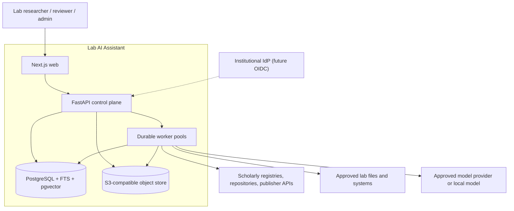
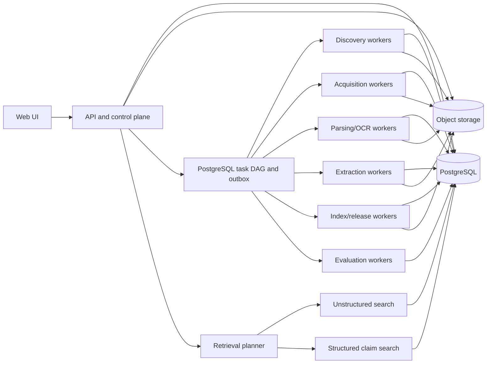

# Target Architecture

## 1. Architecture Style

Use a **modular monolith with process-isolated workers** for the first production generation.

This means:

- one versioned Python domain package;
- one FastAPI control-plane/API deployment;
- several worker entry points built from the same package;
- one Next.js web application;
- PostgreSQL for transactional state, domain records, tasks, audit, FTS, and pgvector;
- S3-compatible object storage for immutable payloads and generated packages;
- no synchronous dependency between worker classes;
- no service-specific database ownership until operational evidence justifies a split.

The system gets the reliability benefit of explicit module and queue boundaries without the deployment and consistency burden of premature microservices.

## 2. Context Diagram



## 3. Container View



## 4. Control Plane and Data Plane

### 4.1 PostgreSQL control plane

PostgreSQL holds:

- users, workspaces, memberships, groups, and grants;
- scopes, connector configurations, and immutable config versions;
- task DAGs, attempts, leases, heartbeats, and outbox events;
- source observations and parsed assertions;
- canonical work identity and human decisions;
- rights policies and decisions;
- asset metadata and object references;
- rendition structures and evidence-span metadata;
- entity, experiment, claim, review, and release records;
- search projection metadata and active aliases;
- chat sessions, messages, citations, feedback, and evaluations;
- append-only audit records.

Large response bodies, files, rendition payloads, model request/response envelopes, and export packages live in object storage. Database records point to immutable object keys and checksums.

### 4.2 Object-storage data plane

Use a content-addressed key convention:

```text
sha256/ab/cd/<full-digest>
```

Logical object metadata belongs in PostgreSQL. Object names do not encode DOI, PMID, user-provided filename, or run directory. Those values can change, collide, or disclose information.

Required object classes:

- raw connector request/response envelopes;
- acquired original assets;
- malware scan reports;
- OCR and parser intermediate files;
- rendition JSON and table/figure artefacts;
- encrypted model request/response envelopes where retention is permitted;
- release/export packages and validation reports;
- evaluation evidence and reproducibility bundles.

Objects are immutable. Retention and legal deletion are implemented as explicit tombstone and purge workflows with audit records, not file overwrites.

## 5. Domain Modules

The Python package should have enforced dependency direction:

```text
contracts -> domain -> application services -> adapters
```

### 5.1 `contracts`

- Pydantic command/event schemas;
- connector capability and result schemas;
- parser and extractor contracts;
- release package schemas;
- generated JSON Schema;
- stable error and outcome taxonomy.

Contracts may depend only on standard library and schema libraries.

### 5.2 `domain`

- workspace and policy concepts;
- work identity graph;
- asset, rendition, span, entity, experiment, claim, and release models;
- state machines and invariants;
- decision records;
- no HTTP, SQLAlchemy, provider SDK, or filesystem code.

### 5.3 `application`

- lifecycle use cases;
- transaction boundaries;
- task planning and idempotency;
- policy checks;
- release validation and publication;
- chat orchestration and citation assembly.

### 5.4 `adapters`

- SQLAlchemy repositories;
- S3 object store;
- scholarly source connectors;
- file parsers, OCR, and table extraction;
- model providers;
- Postgres search implementation;
- email and identity-provider integrations.

## 6. Worker Topology

Use separate queues and worker deployments for different failure and resource profiles:

| Worker pool | Typical work | Resource profile | Concurrency control |
|---|---|---|---|
| Discovery | API pagination, source response storage, assertion parsing | Network, low CPU | Per source credential and host |
| Acquisition | File downloads, assisted registration | Network and storage | Per host, entitlement, and workspace |
| Parsing | PDF/JATS/DOCX/XLSX parsing, OCR, table extraction | CPU/memory, optional GPU | Per parser and file-size class |
| Extraction | Deterministic extraction and approved LLM calls | Network/GPU, cost bounded | Per provider, workspace budget, data policy |
| Indexing | Chunking, embedding, FTS/vector projection | CPU/GPU/database | Per release and embedding model |
| Evaluation | Benchmarks, policy probes, release gates | Mixed | Per release, isolated from production latency |

Do not make worker topology the source of truth. A durable task row records state, lease owner, heartbeat, attempt, input fingerprint, output references, and next eligibility time.

### 6.1 Initial task engine

Implement a PostgreSQL-backed task DAG using `FOR UPDATE SKIP LOCKED`, leases, an outbox table, and advisory locks where useful. This avoids introducing another infrastructure dependency for 50-100 users.

Requirements:

- at-least-once task delivery;
- idempotent handlers;
- bounded retries by error class;
- persisted `Retry-After` and next-attempt time;
- explicit `blocked`, `awaiting_user`, `degraded`, `quarantined`, `failed`, and `cancelled` states;
- dependency-aware continuation;
- dead-letter inspection and manual retry;
- no run state held only in process memory.

Redis or a dedicated workflow engine may be introduced later only after measuring PostgreSQL queue contention or needing capabilities such as month-long timers at much larger scale.

## 7. Distributed Rate and Entitlement Control

Rate limiting must be shared across workers:

- store token buckets or next-permitted timestamps by connector credential and host;
- use database locks to allocate request slots;
- honour provider response headers and `Retry-After`;
- include tool identity and contact details required by each scholarly service;
- distinguish rate limiting, robots/policy blocking, authentication, entitlement, and permanent not-found outcomes;
- never automate institutional SSO or bypass anti-bot controls;
- allow connector-specific bulk/snapshot modes when documented and more appropriate than per-record calls.

## 8. Serving Architecture

### 8.1 Release-aware search

Every query names or resolves a `corpus_release_id`. Search tables are projections keyed by release item and model version. An atomic alias identifies the workspace's current default release.

Initially use:

- PostgreSQL `tsvector` for lexical candidates;
- pgvector tables separated by embedding model and dimension;
- reciprocal rank fusion or measured learned fusion;
- optional reranking behind a provider interface;
- structured SQL over approved claims for numeric/entity/condition queries.

Do not add OpenSearch or a standalone vector service until corpus size, query latency, or ranking features demonstrate a need. The measurable thresholds that make "demonstrate a need" testable rather than rhetorical are in [Scale §4](10-scale-sizing-and-proportionality.md); the index type, its parameters, and the release build cost they imply are spike S4 in [Spikes §5](12-technical-spikes-and-open-choices.md).

### 8.2 Retrieval planner

The planner classifies a query into one or both paths:

1. **Evidence retrieval:** passages, sections, tables, and captions.
2. **Structured retrieval:** entities, experiments, measurements, units, conditions, and reviewed claims.

Results are joined by canonical work and evidence spans, policy-filtered, reranked, and supplied to generation with stable citation handles.

### 8.3 Answer generation

Generation receives:

- workspace and user policy context;
- selected release ID;
- query and optional conversation context;
- retrieved evidence blocks with immutable citation IDs;
- reviewed structured claims;
- explicit unsupported/gap states;
- prompt bundle ID and version.

The provider returns text and citation handles. The server validates that every cited handle was supplied and stores the complete answer provenance. A response cannot invent a new source identifier.

## 9. API Boundaries

Use resource-oriented APIs under `/api/v1`, with long-running work represented as jobs/runs and events.

Primary resource groups:

```text
/auth, /users, /workspaces, /memberships
/scopes, /discovery-runs, /observations, /candidates, /decisions
/acquisition-plans, /assets, /assisted-acquisitions
/renditions, /parse-runs, /evidence-spans
/templates, /extraction-runs, /claims, /reviews
/exports, /corpus-releases, /indexes, /evaluations
/chat/sessions, /search, /feedback
/tasks, /audit-events, /operations
```

API conventions:

- cursor pagination for every collection;
- optimistic concurrency via version/ETag for reviewer edits;
- idempotency keys for create/run/publish operations;
- problem-details error envelopes;
- separate request, resource, and event schemas;
- server-sent events only for progress/token streaming, not as the sole state store;
- bulk APIs produce a durable job and downloadable result package;
- OpenAPI generated and checked into documentation artefacts.

## 10. Frontend Information Architecture

The first screen after login is the working application, not a landing page.

```text
Workspace selector
  - Ask
  - Collections
      - Scope and discovery
      - Candidate decisions
      - Acquisition queue
      - Parsing quality
      - Extraction review
      - Releases and exports
  - Evaluation
  - Administration
      - Members and groups
      - Sources and credentials
      - Policies and budgets
      - Operations and audit
```

Core UI rules:

- one candidate detail view shows all source assertions and conflicts;
- one asset detail view shows acquisition attempts, rights, checksum, and renditions;
- evidence review shows quote in source context with page/section/table coordinates;
- review queues support paging, filtering, assignment, keyboard navigation, and bulk decisions;
- a progress page reads durable stage state and never infers completion from a missing worker heartbeat;
- users can resume assisted acquisition in the same workflow;
- release comparison shows additions, removals, changed assertions, retractions, parser/model changes, and evaluation deltas.

## 11. Deployment Profiles

### 11.1 Local development

Docker Compose provides:

- PostgreSQL with pgvector;
- S3-compatible local object store;
- API;
- web;
- one instance of each worker class, optionally collapsed for laptops;
- a fake scholarly connector and fake model provider for deterministic tests.

### 11.2 Production

Recommended initial production shape:

- managed PostgreSQL 16+ with pgvector and point-in-time recovery;
- institution-approved S3-compatible object storage with versioning, encryption, lifecycle rules, and access logs;
- API and web behind TLS and institutional network controls;
- independently deployed worker pools;
- central secret manager;
- structured logs, traces, metrics, and alerting;
- scheduled backup restore tests;
- outbound network allowlist where operationally possible.

### 11.3 Scale triggers

Revisit architecture only when measured thresholds are crossed:

| Concern | Trigger to evaluate a split |
|---|---|
| Task engine | Sustained lock contention or queue latency above SLO despite indexing and partitioning. |
| Search | Corpus/ranking features exceed Postgres latency or operational limits. |
| Object metadata | Database/object-list operations become a material bottleneck. |
| Parsing | GPU/OCR fleet requires independent release or autoscaling cadence. |
| Tenancy | Contractual isolation requires per-workspace infrastructure. |
| Availability | Business requirements demand regional failover beyond managed service capabilities. |

## 12. Key Architecture Decisions

| ADR | Decision | Rationale |
|---|---|---|
| ADR-001 | Source-neutral evidence graph, not a paper table | Avoids PubMed-shaped universality. |
| ADR-002 | Modular monolith with worker processes | Clear boundaries at current scale without distributed transactions. |
| ADR-003 | PostgreSQL control plane and initial search | Fits team and scale; reduces operational surface. |
| ADR-004 | Immutable content-addressed object store | Makes replay, deduplication, integrity, and citation stability possible. |
| ADR-005 | Durable PostgreSQL task DAG | Supports restart/resume and separate worker pools without another platform. |
| ADR-006 | Workspace and policy scope on all domain objects | Makes lab-agnostic use safe by construction. |
| ADR-007 | Claims/evidence graph with template projections | Represents many experiments per work and keeps exports auditable. |
| ADR-008 | Immutable corpus releases and atomic aliases | Enables validation, comparison, rollback, and reproducibility. |
| ADR-009 | Separate embedding projection tables | Supports dimensions/models without rewriting domain records. |
| ADR-010 | LLM outputs are unapproved proposals | Preserves scientific and audit integrity. |

These should become individual ADR files when implementation starts. The decision table in this plan is the migration baseline, not a substitute for repository ADRs.
