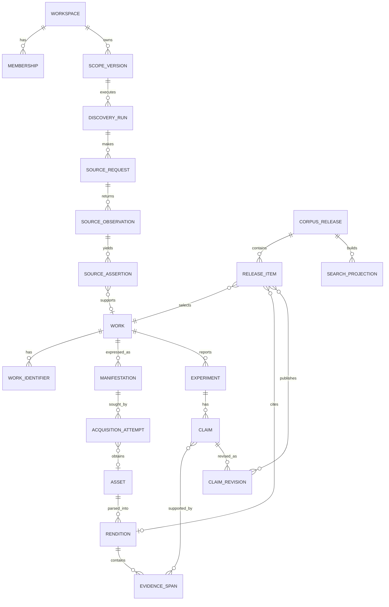

# Data Model and Provenance

## 1. Design Objective

The data model must preserve the difference between:

- what a source returned;
- what the system inferred from it;
- what a human decided;
- what bytes were lawfully acquired;
- what a parser observed in those bytes;
- what an extractor proposed;
- what a reviewer approved;
- what a release made searchable;
- what evidence an answer cited.

These differences are the audit trail. They must not be flattened into metadata JSON or inferred from filenames.

## 2. Aggregate Map



## 3. Common Columns and Rules

Every workspace-scoped mutable aggregate has:

- `id UUID` generated by the system;
- `workspace_id UUID` as a required partition/policy key;
- `created_at`, `created_by`;
- `updated_at`, `updated_by` where updates are allowed;
- `version INTEGER` for optimistic concurrency;
- `status` from a documented state machine;
- an append-only audit event for each state or value change.

Immutable records have `created_at` but no general update operation. Corrections create successor records and relations.

Use UTC timestamps in storage and ISO 8601 in APIs. Preserve source time strings in raw observations where source precision or timezone is uncertain.

Human-readable names are never identifiers. External identifiers are normalised for matching but the original source representation remains available.

## 4. Identity and Tenancy

### 4.1 Identity tables

#### `users`

```text
id, email_normalized, email_display, hashed_password, full_name,
is_active, auth_epoch, created_at, updated_at
```

`auth_epoch` supports revoking all tokens after security events. Password hashing parameters are upgradeable.

#### `workspaces`

```text
id, slug, display_name, status, default_policy_bundle_id,
current_release_alias_id, branding_config_version_id
```

#### `memberships`

```text
id, workspace_id, user_id, role, status, invited_by,
accepted_at, expires_at
```

Unique: `(workspace_id, user_id)`.

#### `groups` and `group_memberships`

Groups represent projects, restricted teams, or reviewer pools. They are not embedded in free-form document metadata.

### 4.2 Resource grants

A normalised grant records:

```text
workspace_id, subject_type, subject_id, resource_type, resource_id,
action, effect, policy_basis, valid_from, valid_until
```

Actions include `discover`, `view_metadata`, `view_content`, `process_local`, `send_external`, `index`, `query`, `export`, `administer`, and `review`.

Default deny applies to content actions. Workspace-wide grants can be materialised for efficient retrieval, but the authoritative policy remains explicit.

## 5. Scope and Configuration

### 5.1 `scope_versions`

An immutable scope version contains:

- stable `scope_id` and monotonic version;
- name and scientific objective;
- inclusion and exclusion criteria;
- date, language, publication/resource-type boundaries;
- search concepts and controlled terms;
- source connector plan and query per source;
- required source completeness policy;
- relevance decision policy;
- intended downstream uses;
- configuration object checksum;
- author, reviewer, approval state.

A run references a specific version. Editing a scope creates another version.

### 5.2 `config_versions`

Generic immutable configuration objects support:

- connector configuration excluding secrets;
- parser profiles;
- extraction templates;
- prompt bundles;
- retrieval profiles;
- rights policies;
- evaluation benchmark definitions.

Each row records `kind`, stable logical ID, semantic version, canonical JSON, schema version, checksum, and lifecycle status.

Secrets are referenced by secret-manager key ID and never included in config JSON.

## 6. Discovery Provenance

### 6.1 `discovery_runs`

```text
id, workspace_id, scope_version_id, status, started_at, completed_at,
requested_by, run_fingerprint, expected_connectors, completed_connectors,
degraded_reason, frozen_at, metrics_json
```

`run_fingerprint` covers the scope, all connector configuration/version identifiers, starting cursors, and orchestration version.

### 6.2 `source_requests`

One record per logical upstream request:

```text
id, discovery_run_id, connector_id, connector_version,
request_fingerprint, method, canonical_url_redacted, request_body_object_id,
requested_at, completed_at, response_status, response_headers_allowed,
response_body_object_id, response_sha256, source_cursor_before,
source_cursor_after, attempt_number, outcome, error_class
```

Credentials and sensitive query parameters are redacted from stored URL fields. If the query itself is sensitive, it is stored in encrypted workspace-scoped object storage and referenced by ID.

### 6.3 `source_observations`

An observation identifies one record parsed from one response:

```text
id, source_request_id, source_record_locator, parser_id, parser_version,
schema_version, canonical_record_object_id, canonical_record_sha256,
observed_at, parse_status
```

The raw response is the replay boundary. The canonical record is the parsed boundary.

### 6.4 `source_assertions`

Every asserted field is addressable:

```text
id, source_observation_id, subject_hint, predicate, value_json,
normalised_value_json, confidence, source_priority_class,
asserted_at_source, valid_from_source, status
```

Examples:

- DOI is `10.x/...`;
- title is a value;
- PMID is a value;
- type is `journal-article`;
- work A `is_version_of` work B;
- author position 1 has ORCID X.

Canonical metadata is a materialised view or resolved-value table over active assertions plus decisions. It is not the only copy of the evidence.

## 7. Work Identity Graph

### 7.1 `works`

A work is intentionally sparse:

```text
id, workspace_id, work_kind, identity_status, canonical_metadata_version,
retraction_status, correction_status, created_at
```

`work_kind` includes article, preprint, dataset, software, protocol, thesis, report, book chapter, conference item, internal document, and unknown.

### 7.2 `work_identifiers`

```text
id, work_id, scheme, value_normalized, value_display,
assertion_id, confidence, status
```

Strong schemes include DOI, PMID, PMCID, arXiv, bioRxiv DOI/version, DataCite DOI, accession number, internal record ID, and content digest where appropriate.

Constraints:

- an active normalised identifier maps to at most one active work within the relevant identity namespace;
- a contradiction produces `identity_conflict`, not last-write-wins;
- a DOI alone does not imply resource kind; registration agency and source type are assertions.

### 7.3 `work_relations`

Represent `is_version_of`, `is_preprint_of`, `is_supplement_to`, `is_dataset_for`, `corrects`, `retracts`, `cites`, and `duplicates` without collapsing related works.

### 7.4 `identity_decisions`

```text
id, workspace_id, decision_type, subject_work_ids, supporting_assertion_ids,
before_json, after_json, reason_code, note, decided_by, decided_at
```

Decision types include merge, split, link-version, reject-link, resolve-field, and reopen.

Automatic merge requirements:

1. at least one exact strong identifier bridge;
2. no contradictory active strong identifier;
3. resource kinds are compatible;
4. configured confidence threshold is met;
5. complete decision explanation is persisted.

Title, author, and year similarity can propose a candidate pair, but cannot satisfy requirement 1.

## 8. Manifestations, Acquisition, and Assets

### 8.1 `manifestations`

A manifestation describes a retrievable version or file role:

```text
id, work_id, manifestation_kind, version_label, publication_state,
declared_mime, language, relation_assertion_ids, status
```

Examples: version of record, accepted manuscript, preprint v3, PMC XML, supplement table S2, local protocol revision 5.

### 8.2 `acquisition_plans`

A plan freezes:

- manifestation candidates;
- ordered route strategies;
- rights policy version;
- requested processing and export purposes;
- route-specific credentials/entitlements by reference;
- automatic versus assisted boundaries;
- requester and approval where needed.

### 8.3 `acquisition_attempts`

Store every attempt, not only the final result:

```text
id, acquisition_plan_id, manifestation_id, connector_id, route,
attempt_number, requested_at, completed_at, outcome, http_status,
retry_after, source_url_redacted, response_object_id, asset_id,
error_class, note, worker_version
```

Outcome taxonomy is defined in the lifecycle document.

### 8.4 `rights_decisions`

```text
id, workspace_id, subject_type, subject_id, policy_version_id,
licence_expression, access_basis, allowed_actions, restrictions,
evidence_assertion_ids, decided_by_type, decided_by, decided_at,
review_due_at, status
```

`decided_by_type` is automatic rule, human steward, or institutional policy import. Human overrides require a reason and expiry/review date where appropriate.

### 8.5 `assets`

```text
id, workspace_id, sha256, byte_length, object_id, media_type_detected,
original_filename_safe, malware_scan_status, validation_status,
created_from_attempt_id, rights_decision_id, created_at
```

Unique object bytes are globally deduplicable only if encryption and policy allow it. Asset metadata and access remain workspace-scoped. The safe default is workspace-scoped object encryption and no cross-workspace cache reuse.

That default is not free: it means the same public paper is acquired, stored, and parsed once per workspace. Together with the other costs of shared-safe tenancy it is quantified in [Scale §3.3](10-scale-sizing-and-proportionality.md), which recommends tenancy-ready single-tenant until a named second lab commits.

An asset cannot enter parsing unless:

- checksum matches stored bytes;
- media type is permitted and validated;
- malware scan passed or an explicitly approved exception exists;
- a current rights decision allows local processing.

## 9. Renditions and Evidence Addressing

### 9.1 `parse_runs`

```text
id, asset_id, parser_id, parser_version, parser_profile_version_id,
input_sha256, run_fingerprint, status, started_at, completed_at,
quality_metrics, log_object_id
```

The run fingerprint covers asset digest, parser binary/package version, profile, OCR engine/model/language, and normalisation version.

### 9.2 `renditions`

```text
id, parse_run_id, format, schema_version, object_id, sha256,
language, page_count, section_count, table_count, figure_count,
quality_status, supersedes_rendition_id
```

The rendition payload stores a document tree with stable node identifiers.

### 9.3 Rendition node model

```text
Document
  Section(id, label, title, level, source_coordinates)
    Paragraph(id, text, source_coordinates)
    List(...)
    Table(id, cells, caption, footnotes, source_coordinates)
    Figure(id, caption, asset_ref, source_coordinates)
```

Coordinates may include:

- JATS element path and character offsets;
- PDF page, bounding boxes, and text offsets;
- spreadsheet sheet/cell range;
- DOCX paragraph/table IDs;
- source row ID and column for CSV/TSV.

### 9.4 `evidence_spans`

```text
id, rendition_id, node_id, start_offset, end_offset,
quote_sha256, quote_preview, locator_json, context_object_id
```

Creation verifies that the quoted text or structured cell value matches the referenced rendition node. Evidence IDs remain valid as long as the rendition exists. Re-parsing creates a new rendition and new spans; it does not retarget old citations.

## 10. Scientific Entity and Claim Model

The core should be expressive enough for biomedical and other lab domains without hard-coding one ontology.

### 10.1 `entities`

```text
id, workspace_id, entity_type, preferred_label, normalised_value,
ontology_namespace, ontology_id, resolution_status
```

Examples include organism, strain, gene, protein, compound, material, instrument, assay, unit, institution, and author.

### 10.2 `experiments`

```text
id, work_id, rendition_id, local_label, experiment_type,
description_claim_id, extraction_run_id, review_status
```

A work can report zero, one, or many experiments. Experiments may contain groups, samples, treatments, controls, time points, and conditions through typed relations.

### 10.3 `claims`

```text
id, workspace_id, work_id, experiment_id, subject_entity_id,
predicate, object_kind, object_value_json, unit_entity_id,
qualifiers_json, polarity, epistemic_status, extraction_run_id,
current_revision_id, lifecycle_status
```

Examples:

- strain X produces compound Y;
- culture had temperature 30 degrees C;
- yield was 0.42 g/g substrate under specified conditions;
- method used instrument Z;
- source did not report oxygen transfer rate after a documented exhaustive search.

### 10.4 `claim_revisions`

```text
id, claim_id, revision_number, value_json, evidence_span_ids,
proposal_source, extractor_fingerprint, validation_status,
review_status, confidence_components, abstention_reason,
created_by, created_at, supersedes_revision_id
```

`proposal_source` may be deterministic parser, model, imported dataset, or human. A human-authored interpretation without a direct span must be clearly typed and cannot masquerade as extracted source fact.

### 10.5 `reviews`

```text
id, subject_type, subject_id, assignment_id, decision,
before_json, after_json, reason_code, comment, reviewer_id,
reviewed_at, policy_version_id
```

Review decisions are immutable. A correction creates a new claim revision and review.

### 10.6 Units and numeric normalisation

Store:

- verbatim value and unit;
- parsed numeric value or interval;
- canonical unit and converted value where conversion is valid;
- basis and denominator, such as dry cell weight, volume, substrate, time;
- uncertainty, significant figures, and detection limits;
- qualifiers and experimental conditions;
- conversion library/version and formula.

Never compare two measurements solely because their display units look similar.

## 11. Extraction Reproducibility

### 11.1 `extraction_runs`

```text
id, workspace_id, template_version_id, prompt_bundle_version_id,
selector_version, validator_version, provider, model, model_revision,
model_settings_json, policy_version_id, status, requested_by,
started_at, completed_at, metrics_json
```

### 11.2 Per-item fingerprint

The cache/idempotency fingerprint is a canonical hash over:

```text
workspace processing scope
rights/policy scope
asset digest
rendition digest
ordered selected node IDs and exact span digests
canonical deterministic metadata digest
template ID and complete versioned schema
column/claim definitions and hints
system and user prompt bundle contents
selector, prompt-builder, validator, and parser versions
provider, model revision, temperature, seed if available, and output mode
```

A cache entry references immutable request and response envelopes. A cache hit cannot change review state or copy a result across a workspace/policy boundary unless an explicit approved sharing policy says it may.

## 12. Templates and Export Projections

### 12.1 `template_versions`

A template defines:

- intended scientific use;
- target claim/entity predicates;
- required evidence standard;
- cardinality: one per work, experiment, sample, claim, or relation;
- value types, unit expectations, controlled vocabularies;
- deterministic metadata columns;
- reviewer requirements;
- long-form and optional wide projections;
- semantic version and migration notes.

Changing column order alone can be a patch. Changing meaning or cardinality requires a major version.

### 12.2 Datasheet projection rule

The default export is long-form and lossless:

```text
work_id, experiment_id, claim_id, revision_id, subject, predicate,
value_verbatim, value_normalised, unit, qualifiers, evidence_span_id,
source_locator, review_status, template_version
```

Wide XLSX/CSV is generated only as a convenience view. It contains stable IDs back to long-form records and an explicit policy for multiple experiments/values. It is never the only release artefact.

## 13. Corpus Releases and Search Projections

### 13.1 `corpus_releases`

```text
id, workspace_id, name, semantic_version, status, parent_release_id,
scope_version_ids, policy_version_id, release_manifest_object_id,
manifest_sha256, created_by, approved_by, published_at,
evaluation_run_id, superseded_by_id
```

States: draft, validating, rejected, approved, publishing, published, superseded, withdrawn.

### 13.2 `release_items`

```text
release_id, work_id, manifestation_id, asset_id, rendition_id,
claim_revision_ids, access_policy_snapshot_id, inclusion_reason,
source_discovery_run_ids
```

The release manifest is sorted and canonicalised before hashing.

### 13.3 Chunks and embeddings

Chunks are projections, not the canonical text:

```text
search_chunks(
  id, release_id, rendition_id, node_ids, content, content_sha256,
  chunker_id, chunker_version, token_count, metadata_projection
)

chunk_embeddings_<dimension>(
  chunk_id, embedding_profile_id, vector, created_at
)
```

Alternative implementation: one table per embedding profile, created and migrated by a projection registry. Do not mix vector dimensions in one column and do not put embedding columns on the domain `evidence_span` or `asset` records.

### 13.4 Search aliases

```text
search_aliases(workspace_id, alias, release_id, switched_at, switched_by)
```

Publishing builds and validates new projections, then atomically switches the alias. Rollback switches it back.

## 14. Chat and Citation Provenance

Retain sessions and messages, adding:

- workspace ID and release ID;
- retrieval profile version;
- query classification and rewritten query versions;
- retrieved claim revision IDs and evidence span IDs with scores;
- policy decision snapshot;
- prompt bundle and model revision;
- generated citation handles and validation result;
- complete latency/token/cost dimensions;
- feedback and flags.

A citation resolves:

```text
message citation -> evidence span -> rendition -> asset -> acquisition attempt
                 -> manifestation -> work -> source assertions
```

That chain is the minimum defensible provenance for a research answer.

## 15. Audit and Provenance Events

Use an append-only `audit_events` table plus object payloads for large diffs:

```text
id, workspace_id, occurred_at, actor_type, actor_id, action,
subject_type, subject_id, run_id, request_id, reason_code,
before_object_id, after_object_id, metadata_json, integrity_hash
```

Events should map naturally to PROV concepts:

- entities: observation, asset, rendition, claim, release;
- activities: request, merge, parse, extract, review, publish;
- agents: user, connector, worker version, model provider.

Full RDF/PROV-O export is optional. The internal relational model must still retain the required lineage.

## 16. Deletion, Retraction, and Correction

### 16.1 Source correction/retraction

- store a new observation/assertion;
- update the work status through a decision or rule;
- identify affected releases, claims, indexes, exports, and chats;
- build a successor release;
- warn users viewing historical answers;
- do not silently mutate historical release content.

### 16.2 Rights revocation

- disable future view/process/export actions immediately;
- remove affected material from active aliases through an emergency successor release;
- preserve only the metadata/audit necessary and lawful to preserve;
- queue object purge according to retention policy;
- record why old package checksums can no longer be fully materialised.

### 16.3 User deletion

Authentication identity deletion or deactivation must not erase required scientific decision provenance. Audit records can pseudonymise the actor under policy while retaining decision integrity.

## 17. Database Integrity Requirements

At minimum, database tests and constraints enforce:

- workspace consistency across every relation;
- one active work per active strong identifier namespace/value;
- immutable object checksum uniqueness within its encryption/deduplication scope;
- no rendition without a valid parse run and asset;
- evidence offsets within the referenced node;
- accepted claims reference accepted revisions;
- published releases are immutable;
- active search aliases reference published releases;
- release search projections contain only release items;
- review decisions reference the exact revision reviewed;
- no task can publish a release before all required gates pass.

## 18. What Is Deliberately Not a Table

Avoid permanent domain tables for:

- one vector column on a paper;
- a universal flat `NormalizedDocument`;
- arbitrary datasheet cells as the scientific source of truth;
- run-local file paths as asset identity;
- source priority as a replacement for assertions;
- a single global `chat_visible` access flag;
- a Boolean `complete` without gate results;
- JSON blobs whose important fields cannot be constrained or queried.

JSON remains useful for source-specific payloads, qualifiers, and versioned schemas. It should not hide identity, policy, lifecycle state, or evidence links.
