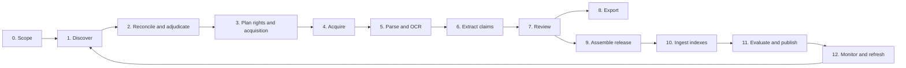

# Data Lifecycle

## 1. Lifecycle Overview



Stages are not a single irreversible conveyor. Each stage consumes immutable inputs, produces immutable outputs plus state transitions, and can be replayed when its implementation changes. Human queues are explicit branches, not errors disguised as pending work.

## 2. Shared Stage Contract

Every task stage implements:

```python
class StageHandler(Protocol):
    stage_name: str
    implementation_version: str

    def fingerprint(self, command: StageCommand) -> str: ...
    async def execute(self, command: StageCommand) -> StageResult: ...
```

`StageCommand` includes:

- workspace and actor;
- immutable input IDs and checksums;
- configuration and policy version IDs;
- correlation/run ID;
- idempotency key;
- deadline and budget where applicable.

`StageResult` includes:

- outcome taxonomy;
- created immutable object IDs;
- changed aggregate IDs and versions;
- metrics and quality-gate results;
- next commands or human action required;
- structured errors and retry eligibility;
- audit event IDs.

Handlers must be safe under at-least-once execution. Side effects are registered transactionally or through an outbox.

## 3. Stage 0: Scope and Strategy

**Purpose**

Turn a research intent into an approved, testable, source-specific discovery plan.

**Inputs**

- scientific question and intended uses;
- known relevant and irrelevant seed records;
- population/intervention/organism/material concepts as applicable;
- date, language, resource type, and source boundaries;
- sensitivity and export constraints;
- source access credentials and policies.

**Activities**

1. Define inclusion and exclusion criteria in scientific language.
2. Map concepts to controlled vocabularies and synonyms where available.
3. Create a query per source, because query languages and coverage differ.
4. Define expected connector set and whether each is required or optional.
5. Define a relevance decision policy for definite, uncertain, and excluded candidates.
6. Run query previews and estimate volume/cost.
7. Test against gold seed records and known negatives.
8. Approve and freeze the scope version.

**Outputs**

- immutable scope version;
- source query bundle;
- gold seed evaluation result;
- estimated request and storage budget;
- policy approval.

**Gate**

Do not run production discovery until:

- required fields validate;
- query compilation succeeds for every required connector;
- gold seed recall reaches the workspace threshold;
- the intended use and rights profile are approved;
- source terms and rate policy are current.

## 4. Stage 1: Discovery

**Purpose**

Collect source observations without prematurely deciding canonical identity or relevance.

### Connector execution

For each configured connector:

1. Acquire a distributed request lease.
2. Build a canonical request and fingerprint it.
3. Store request metadata before transmission.
4. Execute with connector-specific timeout, retry, pagination, and cursor rules.
5. Store the response envelope and bytes before parsing.
6. Verify checksum and register the immutable object.
7. Parse observations with a versioned parser.
8. Emit field-level assertions and cursor/checkpoint events.
9. Persist page/batch failures rather than logging and continuing silently.

Connectors can run concurrently when independent, subject to source rate policies.

### Source outcomes

```text
succeeded
succeeded_empty
degraded_partial
rate_limited_retryable
authentication_required
policy_blocked
source_unavailable_retryable
invalid_query
failed_permanent
cancelled
```

### Quality gate

A discovery run cannot freeze as complete unless:

- all required connectors reached a terminal acceptable state;
- cursor continuity and page counts validate;
- raw response objects exist and checksums pass;
- parser error rate is below threshold;
- duplicate source-record locators are explained;
- gold seed recall and source-level coverage are recorded;
- any degraded source is explicitly accepted by a steward.

Partial results may be inspected, but cannot silently flow to a production release.

### Incremental discovery

Checkpoints are keyed by:

```text
workspace + scope version + connector ID/version + exact query fingerprint
+ source cursor semantics version
```

Changing any component creates a new cursor lineage. Source delta feeds and snapshots are preferred where documented and economical.

## 5. Stage 2: Reconciliation and Adjudication

**Purpose**

Resolve source observations into works and relations while preserving disagreement.

### Automatic steps

1. Normalise each identifier without discarding original form.
2. Resolve identifier namespaces and registration agencies.
3. Build candidate connected components using exact strong identifiers.
4. Detect contradictory strong identifiers or incompatible resource kinds.
5. Materialise resolved fields using field-specific policies.
6. Propose near-duplicate and version relations using title/author/year similarity.
7. Score scope relevance from transparent features or an approved classifier.

### Human queues

- identity conflict;
- merge/split proposal;
- preprint/version-of-record link;
- resource-kind ambiguity;
- uncertain relevance;
- missing identifier requiring manual lookup;
- retraction/correction ambiguity.

### Decisions

Every decision records actor, reason, assertions considered, before/after graph, and scope. There is no hidden "source priority won" update.

**Gate**

Before acquisition planning:

- no included work has an unresolved identity conflict;
- inclusion status is `included`, `excluded`, or explicitly `included_uncertain` under policy;
- strong identifier uniqueness constraints hold;
- related but distinct manifestations are linked, not merged;
- decision metrics include automatic/manual counts and disagreement rates.

## 6. Stage 3: Rights and Acquisition Planning

**Purpose**

Decide what content is needed and which routes are permitted before making content requests.

**Inputs**

- included works and manifestations;
- intended actions: local parse, external extraction, indexing, display, export;
- source licence/access assertions;
- institutional policy and entitlements;
- desired content preference, such as structured XML before PDF;
- budget, deadline, and minimum coverage.

### Route classes

1. Open repository or open-access API.
2. Author/publisher route explicitly licensed for automated text and data mining.
3. Institution-approved bulk or TDM endpoint.
4. User-assisted authorised copy.
5. Metadata/abstract-only fallback where permitted.
6. Unavailable or prohibited.

### Planning rules

- Never infer permission merely from a downloadable URL.
- Record separate permissions for storage, local processing, external transfer, display, export, and retention.
- Prefer structured, versioned, licensed assets.
- Do not automate browser SSO, CAPTCHA, or robots bypass.
- Reuse an existing immutable asset only when its workspace policy, licence, manifestation identity, integrity, and intended actions permit reuse.

**Gate**

Each planned attempt has a rights-policy decision or enters a steward review queue. No automatic request starts with an unknown policy state.

## 7. Stage 4: Acquisition

### Automatic acquisition algorithm

1. Check for an eligible existing asset by manifestation and digest assertion.
2. Execute ordered route attempts, persisting each result.
3. Stream bytes to a temporary quarantine object while calculating SHA-256 and size.
4. Enforce size, redirect, content-type, and allowed-host limits.
5. Validate magic bytes and expected manifestation type.
6. Scan for malware and active content.
7. Register immutable object and asset metadata.
8. Confirm the asset belongs to the intended work using embedded identifiers, title, and source metadata where possible.
9. Attach a rights decision and create parsing tasks.

### Acquisition outcomes

```text
acquired
already_available
not_found
metadata_only
rate_limited_retryable
source_unavailable_retryable
authentication_required
entitlement_required
robots_or_policy_blocked
licence_not_permitted
identity_mismatch
invalid_content
malware_quarantined
too_large
assisted_required
failed_permanent
cancelled
```

Do not collapse these states into `pending` or `failed`.

### Assisted acquisition loop

The UI must support the complete loop:

1. Show work identity, desired manifestation, permitted acquisition instructions, and why automation stopped.
2. Allow authorised upload or registration of an institutionally managed object.
3. Require the user to select access basis and acknowledge handling policy.
4. Run the same integrity, malware, identity, and rights validations as automatic acquisition.
5. Attach the resulting asset to the original plan and resume downstream tasks.
6. Preserve uploader and decision audit without exposing their private filesystem path.

**Gate**

An asset is parse-ready only if integrity, type, identity, malware, and rights checks pass. Failed items remain visible in coverage metrics.

## 8. Stage 5: Parsing, OCR, and Structural Extraction

### Parser selection

Select parser by detected content, not filename:

| Content | Initial parser path |
|---|---|
| JATS/NLM XML | Namespace-aware JATS parser with section/table/figure references. |
| Born-digital PDF | Layout-aware PDF text and geometry parser. |
| Scanned PDF/image | OCR with language/model/version and page confidence. |
| DOCX | Paragraph, heading, table, footnote, and relationship parser. |
| XLSX/ODS | Workbook, sheet, table, merged-cell, formula/value, and named-range parser. |
| CSV/TSV | Schema/encoding/dialect inference with stable source row IDs. |
| HTML | Sanitised structural parser with source URL and retrieval timestamp. |
| Plain text/Markdown | Encoding-aware block parser. |

### Required rendition output

- hierarchical sections and stable node IDs;
- exact text plus source coordinates;
- tables as structured cells, captions, and footnotes;
- figures and captions, with image references where allowed;
- references marked separately from focal-study content;
- document metadata observed in the asset;
- parser warnings, dropped-object counts, and quality metrics.

### OCR rules

- retain original image/PDF and OCR output;
- store engine/model/language and confidence by page/block;
- flag low-confidence pages for review;
- never silently blend OCR and embedded text without recording the choice;
- validate important scientific symbols, superscripts, subscripts, units, Greek letters, and strain names using domain-neutral character tests plus workspace vocabulary tests.

### Quality metrics

- page/section/table/figure coverage;
- text characters per page and empty-page ratio;
- replacement/control character rate;
- duplicate paragraph ratio;
- reference-section separation accuracy on fixtures;
- OCR confidence distribution;
- detected versus extracted table count;
- embedded DOI/title consistency;
- parser warning/error count.

**Gate**

Renditions become extraction-eligible only when the parser profile threshold passes or a reviewer accepts a documented degraded rendition. The original asset remains available for reparse.

## 9. Stage 6: Structured Extraction

### Step 1: deterministic metadata

Populate DOI, PMID, title, authors, journal, dates, source type, and licence from resolved assertions and asset metadata. Do not ask an LLM to rediscover these fields from partial text.

### Step 2: evidence search plan

For each template target:

1. Map the target to claim predicates, entity types, units, and likely sections/tables.
2. Search the entire eligible rendition using lexical, structural, and optional embedding signals.
3. Select bounded evidence windows while retaining node IDs and offsets.
4. Track searched and unsearched nodes.
5. If the budget cannot cover the required scope, return `not_searched_budget` rather than `not_reported`.

Large documents use paging or multi-pass extraction. No first-section exception may exceed a token cap silently.

### Step 3: proposal generation

Extraction combines:

- deterministic parsers and regex/unit recognisers;
- entity resolvers;
- table extraction;
- an approved structured-output model where beneficial;
- optional local models for restricted content.

The output is one or more entity, experiment, condition, and claim proposals, not one row.

### Step 4: mechanical validation

Validate before persistence as reviewable:

- JSON/schema/type/cardinality;
- controlled vocabulary and unit compatibility;
- evidence span exists and the quoted text matches the rendition node under the versioned
  normalisation contract - "exact bytes" is not achievable for PDF-derived text and must be defined
  before this gate can be enforced; see [Spikes §3](12-technical-spikes-and-open-choices.md);
- section/table/page locator exists;
- evidence is in focal content unless the claim is explicitly about cited literature;
- numeric value agrees with evidence within documented parsing tolerance;
- work/experiment attribution is unambiguous;
- no citation handle was invented;
- all required provenance fingerprints are complete.

Invalid proposals are retained as failed attempts for diagnosis but are not claims awaiting scientific approval.

### Step 5: abstention classification

Use:

```text
reported
not_reported_after_complete_search
not_searched_budget
not_searched_policy
source_unavailable
parse_quality_insufficient
ambiguous_multiple_values
conflicting_values
extractor_abstained
not_applicable
```

Only the first two can support a positive or negative source-content statement.

**Gate**

Proposals enter review only after mechanical validation. An extraction run completes with coverage and failure metrics, not merely because every model call returned.

## 10. Stage 7: Review and Curation

### Review levels

1. **Identity/relevance review** for candidates.
2. **Asset/rendition review** for mismatch or parse quality.
3. **Claim review** for scientific value and evidence.
4. **Release approval** for corpus publication.

The same person may perform multiple roles in a small lab, but the system records each decision separately.

### Claim review screen

Show:

- proposed value and normalised value;
- exact evidence highlighted in page/section/table context;
- work and experiment metadata;
- extraction and validation provenance;
- similar or conflicting claims from the same work;
- edit, accept, reject, defer, and request-reparse actions;
- reason codes and comments;
- previous revisions.

### Review sampling

Workspace policy can require:

- 100 percent review for selected predicates;
- double review for high-impact numeric claims;
- sampled review for high-performing extractors;
- adjudication when reviewers disagree;
- periodic blinded quality sets to measure reviewer consistency.

**Gate**

Only approved claim revisions are eligible for a published claim release. Unstructured literature search may include approved renditions without claim review if policy permits, but citations still use verified spans.

## 11. Stage 8: Export

### Export is a projection

An export references a corpus release or frozen reviewed selection. It never changes source records or becomes the canonical claim store.

### Required package contents

```text
package/
  README.md
  ro-crate-metadata.json
  bagit.txt
  bag-info.txt
  manifest-sha256.txt
  tagmanifest-sha256.txt
  metadata/
    release.json
    schema.json
    provenance.jsonl
    rights-summary.csv
    validation-report.json
  data/
    works.parquet
    manifestations.parquet
    claims.parquet
    evidence.parquet
    entities.parquet
    relations.parquet
    long-form.csv
    wide-form.xlsx          # optional convenience view
  assets-manifest.csv       # references or included assets according to policy
```

The implementation may use a RO-Crate and BagIt-inspired profile before claiming strict conformance. The chosen profile and validator version must be documented.

### Export controls

- filter by the requesting user's export permission;
- distinguish embedded assets from references;
- include licence and restriction summaries;
- redact restricted evidence previews when necessary;
- record exporter, purpose, release, policy version, and checksum;
- expire download links;
- keep package metadata after payload expiry if policy allows;
- validate checksums and schema before marking export complete.

### CSV/XLSX rules

- UTF-8 CSV with explicit dialect;
- stable IDs in every row;
- no formula injection: escape cells beginning with dangerous spreadsheet prefixes;
- preserve verbatim and normalised values separately;
- include evidence IDs and source locators;
- publish a data dictionary;
- state how multiple experiments/values are represented;
- never use blank and `Not reported` interchangeably.

## 12. Stage 9: Corpus Release Assembly

### Draft construction

A steward selects:

- frozen discovery decisions;
- approved work identities;
- eligible manifestations/assets/renditions;
- approved claim revisions;
- access-policy snapshot;
- retrieval and embedding profiles;
- parent release.

The system produces a deterministic manifest and diff against the parent:

- added/removed works;
- changed source assertions;
- new/replaced manifestations and renditions;
- retractions/corrections;
- claim additions, corrections, and withdrawals;
- policy changes;
- parser/template/model changes requiring regeneration.

### Release validation

- relational integrity;
- object/checksum availability;
- access policy completeness;
- evidence-span validity;
- identity-conflict absence;
- required review status;
- licence/export restrictions;
- duplicate and near-duplicate reports;
- deterministic manifest hash.

## 13. Stage 10: Ingestion into Serving Indexes

This is the only stage called ingestion in the new system.

### Steps

1. Read the immutable draft release manifest.
2. Generate versioned chunks from rendition nodes.
3. Build lexical projections.
4. Generate embeddings under a named embedding profile.
5. Build structured claim query projections.
6. Verify projection counts and release membership.
7. Run search smoke tests and policy probes.
8. Mark projections ready, but do not switch the serving alias.

### Idempotency

Chunk identity is derived from release item, rendition digest, node set, chunker profile, and content digest. Embedding identity adds embedding model/revision and normalisation profile.

Rerunning the same release/profile is a no-op or checksum verification. A changed profile creates a parallel projection.

### Failure behaviour

- a failed build never changes an active alias;
- partial projections remain unready and are garbage-collected after diagnosis/retention;
- the release records the failed build and can retry;
- database and object counts are reconciled before readiness;
- logs never claim completion merely because cleanup/finally ran.

## 14. Stage 11: Evaluation and Publication

### Release gates

1. Discovery and identity quality reports are accepted.
2. Acquisition and parse coverage meet scope thresholds.
3. Extraction metrics meet predicate/template thresholds.
4. Retrieval benchmark does not regress beyond allowed bounds.
5. Answer faithfulness and citation validity pass.
6. Access-control leakage probes return zero unauthorised items.
7. Latency, cost, and index-size budgets pass.
8. Backup and rollback targets for the release exist.
9. A steward/approver signs the release.

### Publish

Publishing uses a transaction to:

- mark the release published;
- switch one or more workspace aliases to ready projections;
- emit an outbox event;
- record approver and evaluation result.

The previous release remains available for rollback and historical chat reproduction subject to rights policy.

## 15. Stage 12: Monitoring and Refresh

### Refresh triggers

- scheduled source delta discovery;
- user request;
- connector source update;
- retraction or correction feed;
- rights/licence change;
- parser, template, validator, embedding, or prompt improvement;
- policy or membership change;
- failed-quality remediation.

### Dependency-driven recomputation

```text
new source response -> reparse assertions -> identity decision maybe required
new asset -> parse -> extract -> review -> release
new parser -> new rendition -> new spans -> re-extract affected claims
new template -> extract affected predicates only
new embedding -> rebuild projection only
rights revocation -> policy update -> emergency release/projection
```

The system records why an item was recomputed and which earlier result it supersedes.

### Freshness policy

Each workspace defines:

- source refresh cadence;
- acceptable connector staleness;
- retraction response target;
- assisted queue ageing target;
- review backlog target;
- release cadence;
- retention for raw responses, failed attempts, model envelopes, and superseded projections.

## 16. End-to-End State Model

An item can occupy several orthogonal states. Avoid one overloaded status field.

```text
identity: unresolved | resolved | conflict | merged | split
relevance: unreviewed | included | included_uncertain | excluded
rights: unknown | permitted | restricted | prohibited | expired
acquisition: unplanned | planned | acquired | assisted | unavailable | failed
parse: not_started | ready | degraded | quarantined | failed
extraction: not_applicable | pending | proposed | validated | incomplete | failed
review: unreviewed | assigned | accepted | corrected | rejected | disputed
release: absent | draft | approved | published | withdrawn
```

The UI can derive a concise workflow label, but the database preserves these dimensions.

## 17. Run Cancellation and Resume

- Cancellation stops scheduling new tasks and asks workers to stop at safe checkpoints.
- Completed immutable outputs remain valid and reusable.
- Leases expire if a worker dies; another worker retries idempotently.
- Resume uses the original run/config fingerprint unless the user explicitly forks a new run.
- A changed config never silently resumes an old run.
- External batch jobs are parked with provider job ID, input package digest, submitted-item mapping, and expected outputs frozen at submission.
- Human-action waits have no worker lease and do not count as failures.

## 18. End-to-End Acceptance Scenario

Before the architecture is considered complete, an integration fixture must prove this sequence:

1. Two sources return different metadata for one DOI and one source is temporarily unavailable.
2. The run freezes as degraded until a steward accepts or retries the missing source.
3. A preprint and version of record are linked but not merged.
4. One open asset is acquired automatically; another enters assisted acquisition.
5. A user uploads an authorised copy, which passes identity and rights checks.
6. One PDF requires OCR and contains a table with two experiments.
7. Extraction proposes two measurements and one unsupported value.
8. The unsupported value fails quote validation; a reviewer corrects another value.
9. A long-form export validates and contains the correction and evidence spans.
10. A draft release builds lexical, vector, and structured projections.
11. A restricted group member can retrieve the private work; another workspace member cannot see its existence in results or analytics.
12. Evaluation passes, the alias switches, and chat cites the exact table cells.
13. A retraction observation creates a successor release and flags the historical answer.
14. Rollback restores the previous serving alias without rewriting either release.

This scenario should exist as an executable, deterministic system test using fake connectors and model providers.
