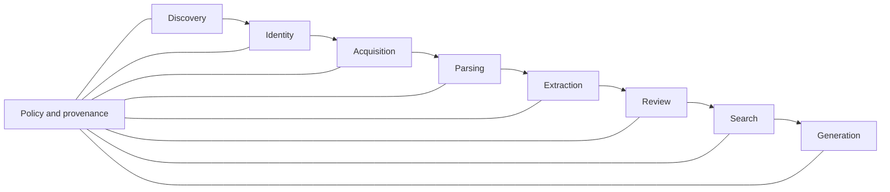

# Quality, Evaluation, and Operations

## 1. Quality Model

Quality is not one end-to-end score. A good answer can hide bad discovery coverage; a good retrieval score can hide access leakage; a plausible datasheet can hide unsupported evidence.

Measure each layer and retain the lineage needed to locate the failing layer.



## 2. Quality Gates by Stage

Thresholds are workspace and use-case configuration. The metric definitions are system-wide contracts.

Two caveats before using this section as a gate. First, every "no regression" threshold below is
undefined until the current system's baseline values are measured in Phase 0
([Scale §2](10-scale-sizing-and-proportionality.md), row 9). Second, the parsing and evidence
thresholds in §2.4 are asserted here without evidence that they are achievable on real documents;
spike S1 measures them and revises any that are not
([Spikes §2](12-technical-spikes-and-open-choices.md)). A threshold that gets quietly lowered under
schedule pressure is worse than one that was negotiated honestly in advance.

### 2.1 Discovery

| Metric | Definition | Initial release expectation |
|---|---|---|
| Gold seed recall | Fraction of known relevant works found by frozen scope. | Threshold set before run; no silent regression. |
| Unique contribution by source | Relevant canonical works found only by each connector. | Reported for source-selection decisions. |
| Required connector completion | Required connectors with acceptable terminal outcome. | 100%, or explicit degraded approval. |
| Pagination integrity | Expected pages/cursors reconciled with stored raw responses. | 100%. |
| Parser failure rate | Source records failing schema parse. | Below agreed connector threshold. |
| Relevance precision sample | Included sample judged relevant by expert. | Baseline and confidence interval recorded. |
| Query reproducibility | Same fixtures/config produce same assertions. | 100%. |

Use the existing 706 DOI gold set as one migration benchmark, not as the universal benchmark for the new product.

### 2.2 Identity

| Metric | Definition | Gate |
|---|---|---|
| Auto-merge precision | Correct automatic merges / sampled automatic merges. | Very high; target agreed before enabling auto-merge. |
| Missed-link recall | Known same-work records linked correctly. | Tracked on gold pairs. |
| Strong-ID contradiction rate | Components with incompatible active strong IDs. | Zero unresolved in publish set. |
| Title-only auto-merges | Automatic merges supported only by fuzzy title. | Zero by invariant. |
| Decision reproducibility | Same assertion graph and policy produce same proposals/explanation. | 100% in fixtures. |

### 2.3 Acquisition

| Metric | Definition | Gate |
|---|---|---|
| Coverage by content tier | Included works with structured full text, PDF, abstract, metadata only, unavailable. | Reported against scope target. |
| Rights completeness | Planned/acquired assets with current action-level decision. | 100%. |
| Attempt provenance | Attempts with route, outcome, request, worker, and policy refs. | 100%. |
| Asset integrity | Registered objects passing checksum on validation sample/use. | 100%. |
| Identity mismatch | Assets rejected as wrong work. | Reported and quarantined; zero in eligible set. |
| Assisted queue age | Time from assisted-required to resolution. | Workspace SLO. |

### 2.4 Parsing/OCR

| Metric | Definition | Gate |
|---|---|---|
| Page coverage | Pages represented in rendition. | 100% or explicit degraded state. |
| Structural coverage | Expected sections/tables/figures captured. | Parser-profile threshold. |
| Duplicate text ratio | Repeated paragraph content from parser tree errors. | Below fixture threshold. |
| Character fidelity | Error rate for scientific symbols and selected terms. | Threshold by profile. |
| Table fidelity | Correct cell values/headers/footnotes on gold tables. | Threshold by intended extraction use. |
| Evidence-coordinate validity | Span locators resolve and content matches under normalisation contract version N. | 100%. |

### 2.5 Extraction and Review

Report by template, predicate, source format, parser profile, model revision, and review state.

| Metric | Definition |
|---|---|
| Field/claim precision | Correct proposed values / all proposed values. |
| Field/claim recall | Correct found values / all gold values. |
| Evidence validity | Proposals whose evidence pointer exactly supports the value. |
| Attribution accuracy | Claims correctly assigned to focal experiment/work. |
| Unit/basis accuracy | Numeric values with correct unit, denominator, and conversion. |
| Abstention accuracy | Correctly classified absent/unavailable/unsearched states. |
| Multi-experiment recall | Experiments identified / gold experiments in work. |
| Reviewer correction rate | Proposals changed during review, by field/predicate. |
| Inter-reviewer agreement | Agreement before adjudication on double-reviewed sample. |
| Calibration | Observed correctness by reported confidence bucket, if confidence is used. |

Gate principles:

- evidence validity must be 100 percent for accepted machine-extracted claims;
- a high average cannot hide a critical low-performing predicate;
- confidence is diagnostic, not approval;
- evaluation excludes unreviewed model output from gold unless explicitly labelled;
- benchmark contamination and model/provider changes are recorded.

### 2.6 Retrieval

Retain the current recall@k and MRR foundation, adding:

- nDCG@k;
- claim retrieval accuracy for structured queries;
- work-level and evidence-span-level recall;
- duplicate-work rate in top-k;
- citation-ready evidence rate;
- filter correctness by release, date, source, entity, and policy;
- retraction exclusion/label behaviour;
- query latency by planning, embedding, database, reranking, and assembly;
- no-result and low-support calibration.

### 2.7 Answer generation

Measure:

- claim-level entailment/faithfulness to supplied evidence;
- citation validity and citation completeness;
- citation placement and correct source attribution;
- unsupported quantitative statement rate;
- correct statement of gaps/uncertainty;
- answer usefulness judged by expert rubric;
- prompt-injection resistance;
- latency, token use, and cost;
- reproducibility metadata completeness.

Model-as-judge can assist, but expert review and mechanical citation checks remain necessary. Judge model, prompt, and calibration set are versioned.

### 2.8 Security and policy

| Metric | Gate |
|---|---|
| Cross-workspace retrieval leakage | Zero. |
| Restricted-item count/analytics leakage | Zero. |
| Unauthorised object URL access | Zero. |
| External model policy violations | Zero. |
| Secrets in repository/log fixtures | Zero unaccepted findings. |
| Citation handles not supplied to model | Zero accepted. |
| Critical/high dependency findings | Zero unaccepted at release. |

## 3. Benchmark Architecture

### 3.1 Benchmark types

```text
benchmarks/
  discovery/
    scopes, gold works, known negatives, source expectations
  identity/
    assertion graphs, merge/split/link decisions
  parsing/
    licensed/synthetic fixture assets and expected structure
  extraction/
    works, experiments, claims, evidence spans, abstentions
  retrieval/
    questions, relevant work/span/claim labels, filters
  generation/
    questions, evidence bundles, rubric, expected citation constraints
  policy/
    users, workspaces, groups, grants, expected allow/deny outcomes
```

### 3.2 Benchmark governance

- record origin, licence, permitted use, and sensitivity;
- version changes and retain prior versions;
- separate development and blinded test sets;
- make reviewer guidelines explicit;
- record adjudication and disagreement;
- prevent restricted benchmark content from entering unauthorised model providers;
- report sample size and confidence intervals where meaningful;
- never overwrite a gold label without an audit record.

### 3.3 Migration benchmark

Use three layers:

1. The current 706 DOI discovery set to measure no-loss migration in the existing RLA domain.
2. A curated sample of current acquisition assets and datasheet rows, corrected into work/experiment/claim/evidence gold labels.
3. At least one different lab-domain fixture to prove the core is not Yarrowia- or PubMed-specific.

## 4. Test Strategy

### 4.1 Unit tests

- identifier normalisation and conflict detection;
- state machines and invariants;
- rights-policy evaluation;
- fingerprints and canonical JSON;
- source parser fixtures;
- parser structure transformations;
- unit conversions;
- evidence exact-match validators;
- chunk and release manifest determinism.

Unit tests use temporary paths and databases. They must never read shared `./data/checkpoints`, real credentials, user home state, or network services.

### 4.2 Contract tests

- every connector against recorded redacted fixtures;
- connector capability manifest against implementation;
- parser input/output schema;
- model provider structured output, streaming, batch, retry, and usage semantics;
- object store immutability and signed URL behaviour;
- API OpenAPI schema compatibility;
- export package schema and validator.

### 4.3 Integration tests

Use real PostgreSQL with pgvector and local S3-compatible storage. Cover:

- transaction/outbox/task lease behaviour;
- worker crash and idempotent retry;
- workspace/RLS enforcement;
- asset registration through parse and evidence spans;
- claim review concurrency;
- release build, alias switch, and rollback;
- policy-filtered FTS/vector/claim retrieval;
- backup/restore of a representative release.

### 4.4 End-to-end tests

Use fake source and model providers to execute the complete acceptance scenario in [Data Lifecycle](04-data-lifecycle.md). Browser tests cover all human queues, assisted upload, cell/claim correction, export, publish, rollback, and citation opening.

### 4.5 Live smoke tests

Live connector tests are opt-in, low-volume, respectful, and never required for ordinary local tests. They verify only current API compatibility and credentials. They do not mutate gold fixtures automatically.

### 4.6 Property and fault tests

- canonicalisation is order independent where policy says it should be;
- published manifests are deterministic;
- repeated tasks do not duplicate effects;
- random worker termination recovers after lease expiry;
- malformed documents stay inside parser resource limits;
- pagination interruption resumes without gaps or duplicate assertions;
- policy remains monotonic under removed grants;
- object corruption is detected before use.

## 5. CI Quality Pipeline

Every pull request:

1. formatting and lint;
2. type checking for Python and TypeScript;
3. unit and contract tests;
4. migration/schema consistency check;
5. generated OpenAPI/JSON Schema drift check;
6. docs links and config examples check;
7. secret scan;
8. dependency and licence scan;
9. container build and vulnerability scan for affected images;
10. focused integration tests using ephemeral services;
11. frontend accessibility and responsive smoke tests for affected screens.

Main/nightly:

- full integration and end-to-end suite;
- benchmark subset and regression comparison;
- opt-in connector live smoke tests in a controlled environment;
- backup restore drill on synthetic data;
- object/checksum reconciliation sample;
- migration upgrade/downgrade rehearsal where downgrade is supported.

Release candidate:

- full workspace benchmark;
- security/policy suite;
- performance and cost test;
- release package validation;
- disaster recovery evidence;
- manual approval of known deviations.

## 6. Observability

### 6.1 Structured context

Every log, metric, and trace carries safe identifiers:

```text
service, version, environment, workspace_id_pseudonymous,
run_id, task_id, stage, connector/parser/provider ID,
attempt, outcome, error_class, trace_id
```

Do not log raw query text, document content, evidence quotes, prompts, tokens, credentials, signed URLs, or source response bodies by default.

### 6.2 Metrics

#### API

- request rate/error/latency by route and status;
- authentication failures and authorisation denies;
- active sessions and SSE disconnects;
- database pool saturation.

#### Tasks

- queue depth and oldest age by stage/state;
- claim-to-start and run durations;
- retries, dead letters, lease expiries, cancellations;
- human-action queue age;
- idempotency/cache hit rate.

#### Connectors

- request rate, status, rate-limit delay, retry-after;
- pagination progress and source cursor lag;
- response size, parser error, records/page;
- terms/credential review due dates.

#### Data

- objects and bytes by class/workspace/retention state;
- checksum failures and orphan references;
- unresolved identity conflicts;
- acquisition/parse/extraction/review coverage;
- active release and projection sizes;
- retraction/correction propagation lag.

#### Models/search

- embedding/generation latency and errors;
- token use and cost by workspace/use case;
- provider batch age;
- retrieval stage latency and candidate counts;
- citation validation failures;
- benchmark regression.

### 6.3 Traces

Trace across API command, task scheduling, worker attempts, external calls, object operations, database transactions, retrieval, and generation. Raw source/content is represented by IDs/checksums only.

## 7. Initial Service Objectives

Final values require owner approval and measurement. Use these as design targets, not contractual promises:

| Objective | Design target |
|---|---|
| Authenticated API availability | 99.5% monthly for internal use. |
| Chat first progress/token indication | p95 under 10 seconds excluding declared provider incident. |
| Non-generation search latency | p95 under 2 seconds for target corpus. |
| Task state durability | No accepted task lost after acknowledged creation. |
| Active release rollback | Under 15 minutes by alias switch. |
| Retraction/correction alert | Detected items surfaced within configured source-refresh interval. |
| Cross-workspace leakage | Zero. |
| Published citation resolution | 100% while rights/retention permit content preservation. |
| Recovery point objective | 24 hours initially; tighten for production decisions. |
| Recovery time objective | 8 hours initially; validate in restore drills. |

For long-running acquisition/extraction, publish progress freshness and queue-age SLOs rather than unrealistic completion latency.

## 8. Alerts

Page or urgent alert:

- suspected cross-workspace or unauthorised object access;
- secret exposure or credential abuse;
- malware found after prior eligibility;
- database/object-store unavailable;
- checksum mismatch on active release;
- active alias points to an unready/missing projection;
- backup/PITR failure;
- retraction emergency workflow failure.

Working-hours alert:

- required connector degraded beyond retry window;
- queue age above SLO;
- repeated lease expiry or dead-letter growth;
- parse/extraction quality regression;
- provider budget near limit;
- assisted/review backlog ageing;
- connector terms/credential review approaching.

## 9. Backup and Disaster Recovery

### 9.1 Back up

- PostgreSQL with point-in-time recovery;
- object-store versioning/replication according to policy;
- secret-manager configuration through provider controls;
- infrastructure and deployment configuration in Git;
- release manifests and package checksums;
- encryption-key recovery material under institutional procedure.

Do not call local cache directories backups.

### 9.2 Restore sequence

1. Restore PostgreSQL to a consistent point.
2. Restore/attach object store and validate sampled references.
3. Verify schema/application compatibility.
4. Validate active release manifests and projection readiness.
5. Start API in maintenance/read-only mode.
6. Start one worker pool at a time and inspect task leases/outbox.
7. Run policy, retrieval, citation, and object integrity smoke tests.
8. Re-enable writes and external connectors.
9. Record achieved RPO/RTO and deviations.

Run a synthetic restore monthly at first and a production-like restore at least quarterly, subject to institutional policy.

## 10. Data Integrity Operations

Scheduled reconciliation checks:

- DB object references exist and digest matches;
- unreferenced objects are reported before retention cleanup;
- source response and observation counts reconcile;
- one active work per strong identifier;
- rendition spans resolve;
- accepted claims have valid reviewed revisions/evidence;
- release manifest rows equal release items;
- search projection rows belong to release;
- active aliases reference published, ready releases;
- export package manifests validate;
- no expired rights decision remains in active release without review.

Unlike the current cache validator, these checks validate semantic and relational consistency, not only file readability.

## 11. Cost and Capacity Management

Track cost by workspace, run, stage, connector, model, and release:

- source API/subscription cost;
- stored raw/assets/renditions/exports;
- parser/OCR compute;
- extraction and generation tokens;
- embedding compute;
- database and object egress;
- reviewer time estimates where useful.

Controls:

- preview/estimate before large discovery or extraction;
- workspace budgets and alert thresholds;
- maximum asset/request size;
- concurrency caps;
- approved model list by task/data class;
- batch mode when cheaper and operationally appropriate;
- deterministic reuse through complete fingerprints;
- retention cleanup only through audited policy.

## 12. Operational Runbooks

Required before production:

1. Deploy and rollback application version.
2. Publish and roll back corpus release.
3. Required connector outage/degradation.
4. Rate-limit or credential exhaustion.
5. Stuck task, expired lease, and dead-letter recovery.
6. Database failover and restore.
7. Object checksum mismatch or missing object.
8. Malware/unsafe upload response.
9. Secret exposure and credential rotation.
10. Suspected access-control breach.
11. Rights takedown or licence revocation.
12. Retraction/correction emergency propagation.
13. External model provider incident or policy change.
14. Export/package validation failure.
15. Parser/model regression and release freeze.

Each runbook includes trigger, severity, roles, commands through supported tooling, decision points, validation, communication, rollback, and post-incident review.

## 13. Release Report

Every corpus release generates a human-readable report:

- scope and source versions;
- discovery source completion and coverage;
- identity conflicts and human decisions;
- acquisition and parse coverage;
- claim review and extraction metrics;
- added, removed, retracted, and corrected works;
- retrieval/generation benchmark comparison;
- policy/security gate result;
- cost/storage/index size;
- known limitations and accepted deviations;
- approver and publication time;
- manifest checksum and rollback release.

This report is the bridge between scientific owners and operators. It should be downloadable with the export package and visible in the UI.
