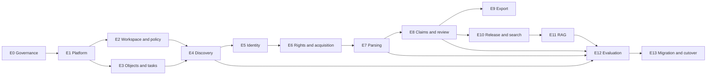

# Implementation Backlog

## 1. How to Use This Backlog

This is an ordered architecture backlog, not a promise that every item belongs in the first sprint. Epics are dependency ordered. Each epic is complete only when its acceptance criteria, policy, tests, documentation, and operations are complete.

Priorities:

- **P0:** required for a secure, auditable first production cutover;
- **P1:** required for full replacement of the current lifecycle;
- **P2:** valuable after measured production need.

**Read [Scale §3](10-scale-sizing-and-proportionality.md) before planning a sprint from this list.**
Eleven of the thirteen epics below are marked P0, which is a list rather than a priority ordering.
That document splits each epic's contents into the parts whose absence causes unrecoverable loss -
which stay P0 at any scale - and the parts that are stageable at the measured scale of this corpus.
An epic marked P0 here does not mean every control inside it ships in the first release.

Delivery sequencing against real staffing, including the M1/M2/M3 milestones that let users see the
system twenty weeks earlier than Phase 6, is in
[Delivery Model §2-3](11-delivery-model-and-continuity.md). The technology decisions that block
E1, E7, E8, E10, and E11 are in [Technical Spikes](12-technical-spikes-and-open-choices.md); run
S1, S2, S5, and S6 before Phase 3 planning is finalised.

## 2. Epic Sequence

## 3. P0/P1 Epics

### E0. Governance, incident, and baseline - P0

Deliver:

- owners and decision forum;
- potential credential incident response;
- legacy architecture freeze policy;
- signed snapshot/inventory and restore test;
- migration exception register;
- initial ADRs and terms review schedule;
- current benchmark baseline.

Accept when:

- no unknown owner exists for product, data, security, connectors, and operations;
- snapshot checksums and restore evidence are stored;
- current 706 DOI benchmark and current RAG evaluation can be rerun;
- tracked secret issue is contained and prevention controls are active.

### E1. Repository, CI, deployment skeleton - P0

Deliver:

- monorepo tree and dependency rules;
- Python/TypeScript tooling;
- FastAPI health/config API and Next.js authenticated shell;
- PostgreSQL, pgvector, local object store, and Compose;
- environment config schema and redacted effective-config command;
- lint/type/unit/integration/docs/security CI;
- production-like deployment skeleton.

Accept when:

- documented quick start passes from a clean checkout;
- services start with fake providers and no network secrets;
- generated OpenAPI/client/schema drift is checked;
- unsupported dependency imports fail CI;
- backup of synthetic environment can restore.

### E2. Users, workspaces, and policy - P0

Deliver:

- users, invitations, memberships, groups, capabilities;
- password login and secure cookie proxy;
- auth epoch/session revocation;
- policy/grant engine and decision audit;
- optional PostgreSQL RLS;
- OIDC-compatible external identity schema;
- admin UI for members/groups/policies.

Accept when:

- two-workspace API/search/object/export tests show zero leakage;
- researcher/admin current journeys are preserved;
- reviewer/data-steward capabilities can be assigned without full admin;
- login, invitation, revocation, CSRF, and audit tests pass.

### E3. Immutable objects and durable orchestration - P0

Deliver:

- content-addressed object registration;
- quarantine and validation lifecycle;
- task DAG, leases, heartbeats, outbox, retries, dead letters, cancellation;
- distributed rate/host request allocation;
- progress and operations API/UI;
- task and object reconciliation jobs.

Accept when:

- duplicate task delivery has one logical result;
- worker kill/restart recovers after lease expiry;
- a registered object cannot be overwritten;
- corrupted and orphaned objects are detected;
- separate worker pools do not depend on shared process memory.

### E4. Scope and source observation platform - P0

Deliver:

- immutable scope/config versions;
- connector SDK and capability manifests;
- PubMed, Europe PMC, Crossref, OpenAlex, and DataCite discovery connectors;
- raw request/response storage and field assertions;
- full query/cursor fingerprints;
- connector progress/degraded-state UI;
- recorded-fixture and opt-in live tests.

Accept when:

- every parsed assertion replays from stored raw response;
- required source failure cannot silently complete a run;
- same fixture/config produces same assertions;
- source requests follow current terms/rate identity policies;
- current discovery benchmark has no unexplained relevant loss.

### E5. Work identity and candidate decisions - P0

Deliver:

- work, identifier, manifestation, relation, and assertion resolution model;
- exact strong-ID reconciliation and conflict quarantine;
- title/author/year duplicate proposals;
- relevance decision model;
- merge/split/link/reject/reopen UI and audit;
- migration identity mapping tool.

Accept when:

- title-only auto-merge is impossible by invariant;
- contradictory strong IDs cannot publish;
- preprint/version-of-record and supplement relations do not collapse works;
- all canonical fields can explain their assertions/decision;
- current PMID/PMCID duplicates produce a reviewed mapping report.

### E6. Rights and acquisition - P0

Deliver:

- action-level rights policy/decision records;
- acquisition plan and full attempt history;
- PMC/Europe PMC, open repository, Unpaywall, approved TDM, and local assisted routes;
- request rate/backoff/circuit semantics;
- upload quarantine, malware, SSRF, MIME, size, checksum, and identity validation;
- assisted acquisition UI and resume;
- asset import/classification tool.

Accept when:

- no parse task exists without permitted local-processing decision;
- every automatic/manual asset has immutable bytes and attempt lineage;
- assisted upload resumes original candidate workflow;
- tests prove SSO/CAPTCHA/robots bypass is not attempted;
- wrong-work and malicious fixtures remain quarantined.

### E7. Renditions, OCR, and evidence spans - P0

Deliver:

- parser contract and sandbox;
- JATS, PDF, OCR, DOCX, XLSX, CSV/TSV parser profiles needed by migration corpus;
- structural rendition schema;
- table/cell/figure/page/section coordinates;
- exact evidence span service;
- parse quality metrics/review/reparse UI;
- parser gold fixtures.

Accept when:

- every span resolves exactly in immutable rendition;
- nested JATS sections do not duplicate body text;
- scanned and born-digital paths are distinguishable;
- workbook rows/cells retain stable IDs and full coverage;
- parser quality gates prevent silent eligible output.

### E8. Structured claims, extraction, and review - P1

Deliver:

- entity/experiment/condition/claim/revision model;
- template, selector, prompt, validator, model versioning;
- deterministic metadata projection;
- exhaustive/multi-pass evidence selection;
- structured output, exact evidence, attribution, numeric/unit validation;
- abstention taxonomy;
- complete extraction fingerprints/cache;
- claim edit/review/double-review/adjudication UI;
- legacy row importer as proposals.

Accept when:

- one work can contain multiple experiments and measurements;
- accepted machine claims have 100 percent mechanically valid evidence;
- different template IDs at version 1 cannot share cache;
- prompt/selector/parser/model change invalidates the intended results;
- reviewers can correct, reject, version, and audit every value;
- benchmark meets predicate-level thresholds.

### E9. Reproducible exports - P1

Deliver:

- long-form works/entities/claims/evidence tables;
- optional wide CSV/XLSX projections;
- schemas, data dictionary, rights summary, provenance, release report;
- RO-Crate/BagIt-inspired package layout and checksum validator;
- signed/expiring download and export audit;
- spreadsheet formula-injection protection.

Accept when:

- package validates offline from checksum and schema;
- every projected value has stable source IDs and review state;
- evidence remains auditable without database access, subject to rights;
- multiple experiments do not disappear in wide projection;
- export cannot include unauthorised content.

### E10. Corpus releases and serving projections - P0

Deliver:

- release state machine, deterministic manifest, parent diff;
- release item policy snapshot;
- versioned chunker and lexical projection;
- separate embedding profile tables;
- structured claim projection;
- alias publish/rollback;
- projection reconciliation and cleanup.

Accept when:

- failed build cannot alter active alias;
- same release/profile rebuild is deterministic;
- vectors can use different dimensions without changing domain schema;
- every projection row belongs to release;
- publish and rollback complete within SLO without reindex;
- **projection build is incremental**: a release whose diff against its parent is N items builds in
  time proportional to N, not to total corpus size, proved by a test comparing a full build against
  a one-item-diff build. Without this, publish time grows with the corpus rather than with the
  change, and frequent releases become impractical
  ([Scale §5](10-scale-sizing-and-proportionality.md)).

### E11. Retrieval, RAG, and citations - P0

Deliver:

- release-aware retrieval planner;
- structured and unstructured retrieval;
- pre-score and post-score access policy;
- fusion/reranking provider interface;
- answer prompt bundle and provider abstraction;
- citation-handle validation and resolver;
- chat sessions/messages/feedback with full provenance;
- familiar researcher interface.

Accept when:

- user cannot retrieve/count/infer inaccessible records;
- citations resolve to immutable spans and supplied handles only;
- answer stores release, retrieval, prompt, model, policy, latency, and cost lineage;
- benchmark meets retrieval/faithfulness thresholds;
- provider failure returns a grounded recoverable state.

### E12. Evaluation, observability, and operations - P0

Deliver:

- benchmark registry and run comparison;
- stage quality reports and release gates;
- structured logs/traces/metrics/dashboards/alerts;
- data integrity reconciliation;
- backup/PITR/restore automation;
- security, connector, task, rights, and release runbooks;
- cost/budget controls.

Accept when:

- release cannot publish with a failed mandatory gate;
- stage regression can be attributed to source/parser/extractor/search/generator;
- alert and restore drills meet documented target;
- logs contain no secrets or raw content in tested paths;
- release report is understandable to scientific owner.

### E13. Legacy migration and cutover - P0

Deliver:

- versioned importers and legacy mapping table;
- A-E asset classification and exception reports;
- user/membership and optional chat archive import;
- discovery/identity/acquisition/claim/release reconciliation reports;
- dual-run and user acceptance;
- final freeze/delta/cutover/rollback;
- archive and retirement.

Accept when:

- mapping counts reconcile and exceptions have owners;
- no legacy vector or unreviewed row is promoted as truth;
- all critical user journeys pass in production-like environment;
- cutover and rollback drills succeed;
- owner signs observation period and retirement.

### E14. Feature parity and ported subsystems - P1

The epics above describe the new lifecycle. They do not account for user-visible capabilities the
current product already has, nor for working subsystems that should be ported rather than rewritten.
The register is in [Delivery Model §5](11-delivery-model-and-continuity.md).

Deliver:

- release-scoped, policy-filtered corpus analytics replacing the current temporal/journal/MeSH/topic
  views, or a written decision to defer them to M3 with users informed;
- direct search endpoint behaviour defined against the new retrieval planner;
- session listing, restore, rename, delete, and auto-titling;
- wide XLSX datasheet as a supported release projection, confirmed with the scientific owner;
- ported operations tooling: deploy, restart, status, logs, and the redacted support bundle;
- ported provider abstraction, resilience layer, and evaluation harness, each re-tested against the
  new contracts rather than copied;
- a configuration ADR that carries forward the `RLALAB_ENV` scenario model and its one-owner-per-
  address rule, reconciled with the layered loading order in
  [Repository Plan §9.1](08-repository-documentation-plan.md).

Accept when:

- every row of the feature-parity register is covered, deferred with a date, or dropped with the
  owner's agreement recorded;
- no current user journey disappears at cutover without the user having been told;
- ported subsystems pass contract tests written against the new model, not the old one.

## 4. P2 Epics After Cutover

These should not delay the clean first release:

- native ELN/LIMS connectors selected by lab demand;
- ORCID/ROR enrichment and advanced author identity;
- image/figure scientific extraction;
- ontology-assisted entity linking beyond template needs;
- collaborative review analytics and active learning;
- external search engine split based on measured scale;
- dedicated workflow engine if PostgreSQL task limits are measured;
- per-workspace infrastructure isolation profile;
- institutional OIDC deployment;
- public metadata-only catalogue, only if product scope later changes through ADR;
- advanced citation graph and systematic-review automation.

## 5. First Six Vertical Slices

Build foundations through usable slices rather than finishing every schema before user feedback.

### Slice 1: one work, one raw observation

Fake connector -> raw response -> assertion -> candidate UI -> audit.

### Slice 2: identity conflict

Two fixture sources -> contradictory IDs -> quarantine -> reviewer decision -> resolved work.

### Slice 3: assisted asset to evidence

Candidate -> rights decision -> user upload -> quarantine -> PDF parse -> exact evidence span UI.

### Slice 4: two experiments and one claim correction

Rendition table -> two experiment proposals -> validator rejects unsupported value -> reviewer corrects one -> long-form export.

### Slice 5: restricted corpus answer

Two groups -> release -> lexical/vector/claim retrieval -> authorised answer citation -> denied-user negative tests.

### Slice 6: refresh and rollback

New source correction -> successor rendition/claim/release -> evaluation -> publish -> answer warning -> alias rollback.

These slices expose architectural mistakes early and can all use deterministic fixtures before live providers.

## 6. Decision Register

Decisions made by this plan:

| Decision | Status |
|---|---|
| New project/repository rather than in-place generalisation | Accepted baseline. |
| Internal-only users and familiar researcher/admin experience | Accepted baseline. |
| Lab-agnostic workspace configuration | Accepted baseline. |
| Modular monolith with independent workers | Accepted baseline. |
| PostgreSQL control plane, initial task queue, FTS, and pgvector | Accepted baseline. |
| S3-compatible immutable object storage | Accepted baseline. |
| Source observations before canonicalisation | Accepted baseline. |
| Work/manifestation/asset/rendition/claim/release separation | Accepted baseline. |
| Strong-ID-only automatic merge | Accepted baseline. |
| Rights action policy before acquisition/processing/retrieval/export | Accepted baseline. |
| LLM output as proposal with evidence verification/review | Accepted baseline. |
| Long-form claim/evidence export is canonical projection | Accepted baseline. |
| Immutable corpus releases and alias-based publication | Accepted baseline. |
| Ingestion means serving projection only | Accepted baseline. |

## 7. Owner Decisions Required Before Phase 1 Ends

These are genuine institutional/product choices; architecture should not guess them.

| Question | Recommended default | Decision owner |
|---|---|---|
| One workspace per deployment or shared multi-workspace deployment? | Build shared-safe; deploy one workspace first. | Product + security. |
| Which managed Postgres and object-store providers are approved? | Choose institution-supported services with PITR/versioning. | Platform/security. |
| May entitled full text be stored, parsed, and excerpted? | Deny until action-specific policy is approved. | Legal/data steward. |
| Which content may be sent to which external model endpoints? | Public/OA only initially; local path for restricted. | Security/legal/product. |
| Retention for raw responses, model envelopes, assets, and superseded exports? | Minimum needed for replay/audit, by class. | Data steward/privacy. |
| Must scientific claims be 100 percent reviewed before release? | Yes for first claim-based release; relax only with measured predicate policy. | Scientific owner. |
| Preserve legacy chat history? | Read-only archive only when user/citation mapping is useful. | Product/privacy. |
| Force password reset at cutover? | Yes, especially after credential incident; use OIDC when ready. | Security/product. |
| Export package strict conformance profile? | Start documented RO-Crate/BagIt-inspired, then certify chosen profile. | Data steward/technical owner. |
| Initial second-domain lab benchmark? | Select one meaningfully different domain before declaring lab-agnostic. | Product/scientific owner. |
| Which delivery profile, and is the assumed team real? | Profile B or the hybrid in [Delivery §2](11-delivery-model-and-continuity.md) unless profile A staffing is named. | Product owner. |
| Project code licence, and open-source intent? | Decide before spike S1; it constrains the PDF parser choice. | Product owner + institution. |
| GPU available on the deployment target? | Assume no; measure CPU embedding throughput and size the publish window accordingly. | Platform. |
| Accessibility standard for the web application? | WCAG 2.2 AA for review and chat surfaces. | Product. |
| Does the wide XLSX datasheet remain a first-class output? | Yes, generated from the release. | Scientific owner. |
| Corpus analytics in the first release, or deferred? | Deferred to M3, stated openly rather than dropped silently. | Product. |
| Which datasheet runs continue on the legacy system during the freeze? | Name them; import their rows as unreviewed proposals. | Scientific owner. |

Record each answer in an ADR or policy decision. None should be hidden in deployment code.

The cost inputs for the multi-workspace decision are in
[Scale §3.3](10-scale-sizing-and-proportionality.md); the recommended default changes to
tenancy-ready single-tenant unless a named second lab has committed.

## 8. Traceability Matrix

| Learned problem in current project | Preventive design | Epic/gate |
|---|---|---|
| PubMed-shaped universal document | Source-neutral observations and work graph | E4/E5 |
| Same PMID stored as `pmid:*` and `pmc:*` | Work identifiers plus manifestations | E5 migration gate |
| Title dedupe merged distinct DOIs | Title-only auto-merge invariant | E5 tests |
| "Raw" cache stored merged candidates | Raw response before parse | E4 replay gate |
| Mutable append cache/checksum drift | Immutable object registration | E3 integrity gate |
| Query-insensitive checkpoints | Full scope/query/connector cursor key | E4 cursor tests |
| Partial source failure still succeeds | Required/degraded connector gate | E4 release gate |
| Acquisition fetch-once only per run | Content-addressed asset store | E6 reuse tests |
| Acquisition attempt history discarded | Attempt table and outcome taxonomy | E6 provenance gate |
| Manual acquisition cannot resume candidate | First-class assisted loop | E6 E2E |
| JATS duplicated/flattened | One parser contract and gold fixtures | E7 parser gate |
| No OCR/table structure | Rendition node/coordinate model | E7 fixtures |
| One row per paper | Experiment/claim graph | E8 benchmark |
| Model fills bibliographic metadata | Deterministic source projection | E8 tests |
| Evidence quote not checked | Exact span/numeric validators | E7/E8 invariant |
| Weak extraction cache key | Complete reproducibility fingerprint | E8 cache tests |
| `Not reported` conflates states | Abstention taxonomy | E8 schema/review |
| CSV loses evidence then becomes fake doc | Long-form package; import tables as datasets | E9 validator |
| Fixed 768 vector | Embedding profile projection tables | E10 integration |
| Partial run leaves plausible manifest | Release state machine and publish gates | E10/E12 |
| Global `chat_visible` | Workspace/action policy before search | E2/E11 leakage gate |
| One worker due in-memory rate state | Durable task/rate coordination | E3 failure tests |
| Docs point to missing config | Validated examples/docs CI | E1 docs gate |
| Duplicated AGENTS/CLAUDE authority | One concise pointer to authoritative docs | E1 docs gate |
| Tracked potential credential | Incident, secret manager/scanning | E0 security gate |

## 9. Definition of Architecture Complete

The design is not complete merely when all tables or endpoints exist. It is complete when:

- the executable end-to-end scenario in the lifecycle document passes;
- every product invariant has a constraint, test, policy gate, or explicit monitored exception;
- every stage can replay from immutable inputs;
- every human decision is inspectable and versioned;
- every answer citation resolves through the full provenance chain;
- a second lab-domain fixture works without modifying core domain code;
- the production release can be restored and rolled back;
- the scientific owner, data steward, security reviewer, and operator approve their gates.
